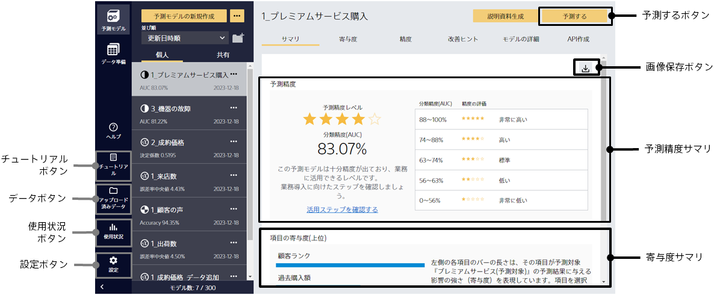
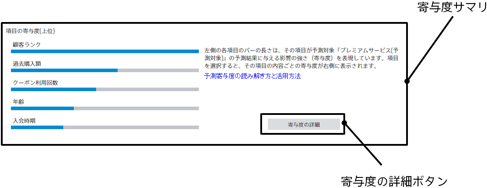

この画面では、学習された予測モデルの予測精度などの評価結果を閲覧できます。
評価では、学習に使用していないデータに対して、学習した予測モデルで予測を実行し、
予測結果と正解の比較により、予測精度を評価します。
各予測タイプ (二値分類、多値分類、数値予測) に即した内容が表示されます。
サマリ、寄与度、精度、改善ヒント、モデルの詳細をクリックすることで表示内容を切り替えることができます。

{}
{}
各予測タイプの主要な精度評価指標と、予測精度レベル、その説明文が表示されます。
予測精度レベルは星の数が多いほど良いことを示します。
データ数を増やすと精度が上がると判定された場合は、その旨がテキストとして表示されます。

精度が良ければこのモデルの活用方法へのリンクが表示されます。
改善すべきところがある場合には改善方法を確認できる【改善ヒント】タブへのボタンが表示されます。
{}
{}

{}
{}
各入力項目について、学習した予測モデルがどの程度重要視しているか・予測に有効かを表します。
棒グラフが長いほど重要度・有効度が高いことを表します。
重要度・有効度の高い項目が予測結果に大きな影響を与えています。
{}
{}

{}
{}
{}
{}

{}
{}

{}
{}
