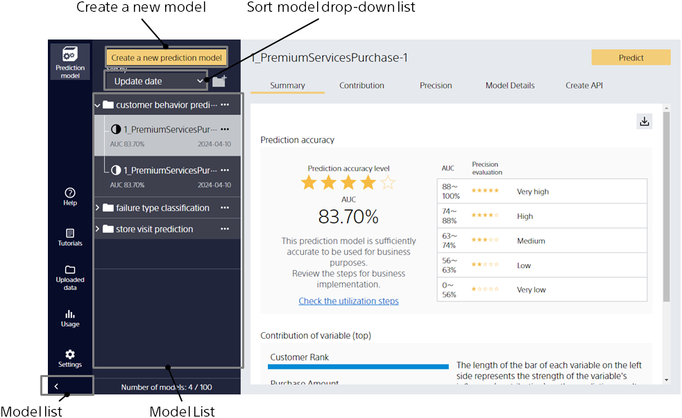
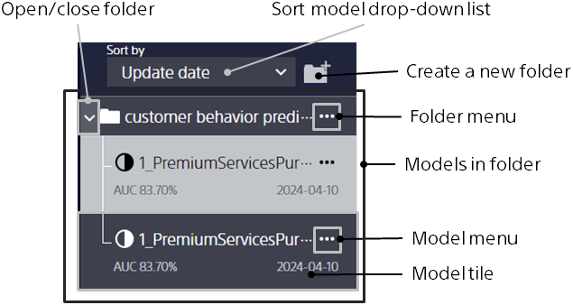
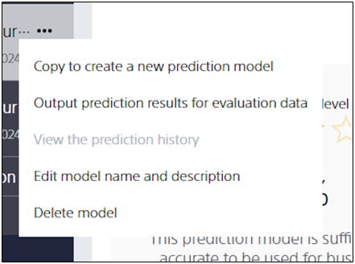
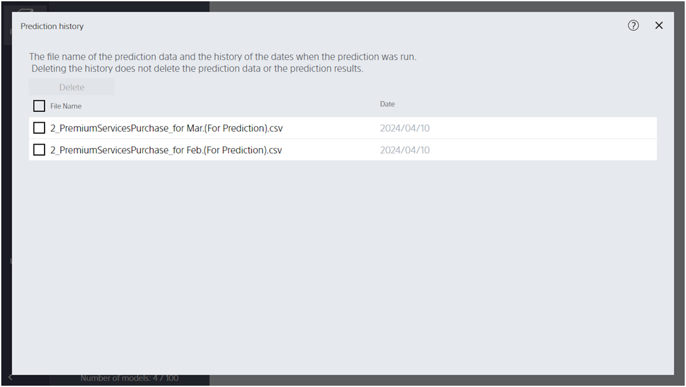
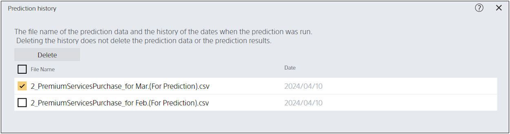

When Prediction One is started and multiple models have already been created, a list of model folders appears on the left.

{}
{}
{}

{}
{}
Click the Model pull-down of the source model and click [Share]. It is copied to the shared space so that users of the same tenant can view and predict model details.
{}

{}
Click the [Share] tab in the Model List. Switches to the shared model list.
{}
{}

{}
{}
Models added to favorites are displayed at the top of the model list.
You can click the [Add to Favorites] button again to remove a model from the favorites.
{}
{}

{}
{}
{}
{}
{}
{}
{}

{}
{}
{}

{}
{}
{}
<u>When you delete a folder, all models within the folder are deleted.</u>
This operation cannot be undone.
{}
{}

{}
{}
{}

{}
{}
{}

{}
{}
{}

{}

If you click the Model pull-down to the right of the model name, a menu similar to the one shown above appears.
From here, you can copy or delete the model.
{}

{}
Click the Model pull-down of the source model and click [Copy and create a new model].
You can open the learning settings screen with the settings of the original model entered.
However, <u>this operation cannot be performed if the training data used to create the source model does not exist in the same location with the same file name.
Also, if you have changed the file contents of the training data after the creation of the original model, subsequent processing may not work correctly</u>.
{}

{}
{}
{}
Click the Model pull-down of the source model and click "Output Prediction Results for Evaluation Data".
You can output the evaluation data used to calculate various metrics on the [Accuracy Details] screen and the prediction results for it as a CSV file.

Normally, the data is output in the order of {prediction result column} → {evaluation data column}, but when the prediction model is created in the time series prediction mode, the data is output in the order of {forecast_before column} → {prediction result column} → {evaluation data column}.
(The {forecast_before column} indicates how far ahead you are evaluating the model. For example, if you evaluate a model that predicts 1, 4, 7, 9, and 12 months into the future, the {forecast_before column} will contain 1, 4, 7, 9, or 12.)
{}
{}

{}
{}
From the prediction history, you can check a list of file names for prediction data that you have predicted using this model in the past.

You can also delete prediction history.

Select the prediction data you want to delete and click Delete.
<u>This operation only deletes the history of the prediction data left in Prediction One, not the prediction data itself </u>.
{}
{}

{}
{}
Click the Model pull-down of the source model and click [Export the prediction model].
You can save a prediction model and the files that the prediction file references (the data for prediction model creation (training), etc.) in a single ZIP file.
The exported model (ZIP file) can be copied to another PC and imported to migrate the model.
{}
{}

{}
{}
{}

{}
{}
{}

{}
{}
{}
