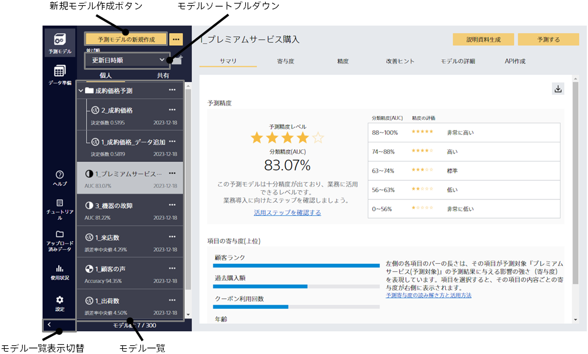
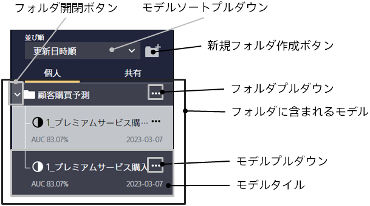
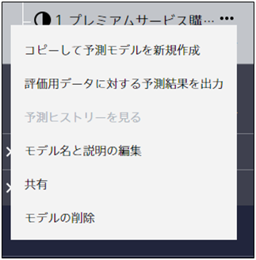
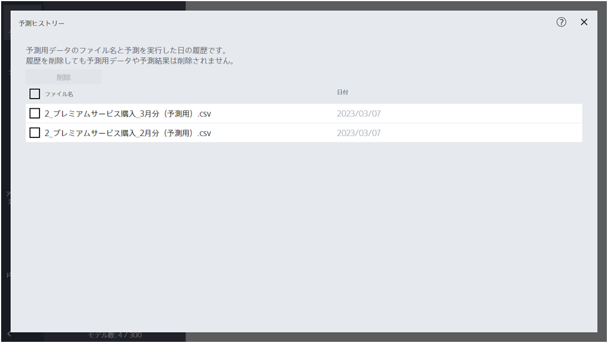
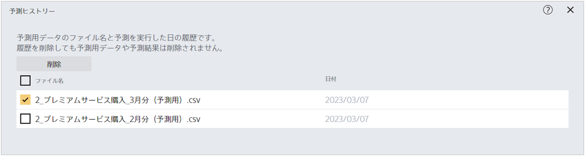

Prediction One を起動した状態で複数のモデルがすでに作成されているとき、左側にモデル・フォルダーの一覧が表示されます。

{}
{}
{}

{}
{}
元となるモデルのモデルプルダウンをクリックし、「共有」をクリックしてください。共有用のスペースにコピーされ、同じテナントのアカウント利用者がモデル詳細の閲覧や予測ができるようになります。
{}

{}
モデル一覧の「共有」タブをクリックしてください。共有用のモデル一覧がに切り替わります。
{}
{}

{}
{}
お気に入りに追加されたモデルは、モデル一覧にて並び順の上位に表示されるようになります。
再び「お気に入りボタン」をクリックすることでお気に入りから外すことができます。
{}
{}

{}
{}
{}
{}
{}
{}
{}

{}
{}
{}

{}
{}
{}
<u>フォルダーを削除した場合、フォルダー内部のモデルはすべて削除されます。</u>
この操作は取り消すことができません。
{}
{}

{}
{}
{}

{}
{}
{}

{}
{}
{}

{}

モデル名の右側に表示されているモデルプルダウンをクリックすると、上のようなメニューが表示されます。
ここから、モデルのコピーや削除を行うことができます。
{}

{}
元となるモデルのモデルプルダウンをクリックし、「コピーして予測モデルを新規作成」をクリックしてください。
元となるモデルの設定が入力された状態で、学習設定画面を開くことができます。
ただし、<u>元となるモデルの作成時に利用した学習データが同じ場所に同じファイル名で存在しない場合、この操作は実行できません。
また、元となるモデル作成後に学習データのファイル内容を変更していた場合、その後の処理が正しく動作しない場合があります</u>。
{}

{}
{}
{}
元となるモデルのモデルプルダウンをクリックし、「評価用データに対する予測結果を出力」をクリックしてください。
「精度」画面で各種精度を算出するのに使用した評価用データと、それに対する予測結果を csv ファイルで出力できます。

通常は、{予測結果列}→{評価用データ列}の順番で出力されますが、時系列予測モードで予測モデルを作成した場合は、{forecast_before 列}→{予測結果列}→{評価用データ列}の順番で出力されます。
({forecast_before 列}はどれだけ先を予測するモデルに関する評価なのかを表します。たとえば、1 ヶ月先、4 ヶ月先、7 ヶ月先、9 ヶ月先、12 ヶ月先を予測するモデルを評価した場合、{forecast_before 列}には、1, 4, 7, 9, 12 のいずれかの値が入ります。)
{}
{}

{}
{}
予測ヒストリーから、過去にこのモデルを使って予測した予測用データのファイル名一覧を確認できます。

予測ヒストリーは削除することもできます。

削除したい予測用データを選択し、削除をクリックしてください。
<u>この操作では Prediction One に残された予測用データの履歴のみが削除され、予測用データそのものが削除されることはありません</u>。
{}
{}

{}
{}
元となるモデルのモデルプルダウンをクリックし、「予測モデルをエクスポート」をクリックしてください。
予測モデルと、予測モデルが参照しているファイル(予測モデル作成(学習)用データなど)を、1つのzipファイルに圧縮して保存できます。
エクスポートされたモデル(zipファイル)は、別のPCにコピーし「予測モデルをインポート」すると、モデルを移行できます。
{}
{}

{}
{}
{}

{}
{}
{}

{}
{}
{}
