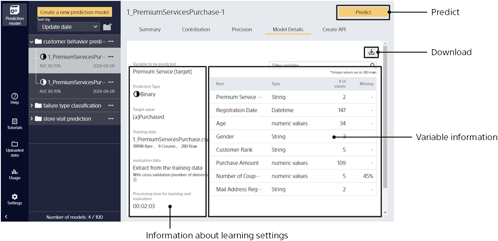

Click the [Model Details] tab to enter this screen.

{}
{}
Select the model you want to view in the model list to display information about the selected model.
{}
{}

{}
{}
Select the model you want to view in the model list to display information about the selected model.
{}
{}

{}
{}
{}
{}
