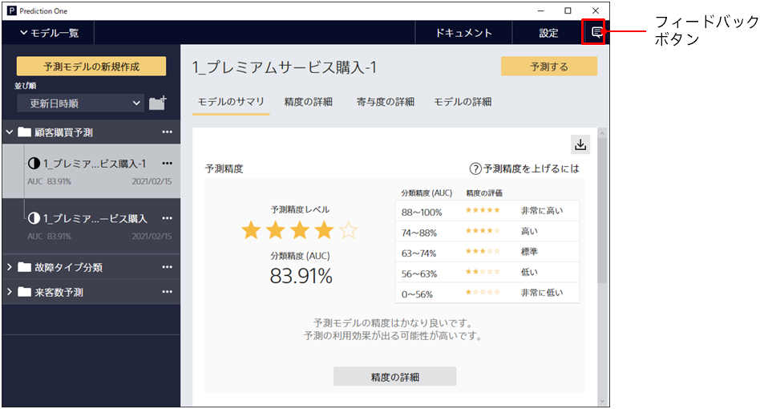
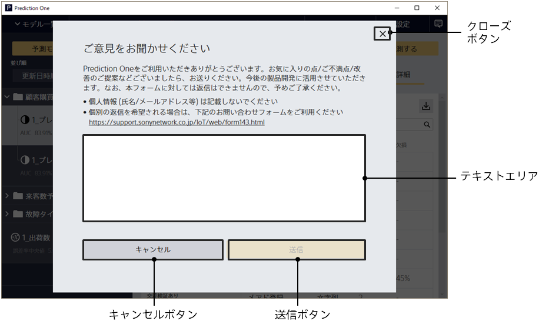

When Prediction One is running, click the Feedback button in the upper right to go to the Feedback form.

Feedback Form

{}
{}
{}
Please let us know what you think about using Prediction One.
<u>Please note that we will not be able to reply to content sent from this feedback form. Also, please do not enter personal information such as name and email address.</u>
{}
{}
