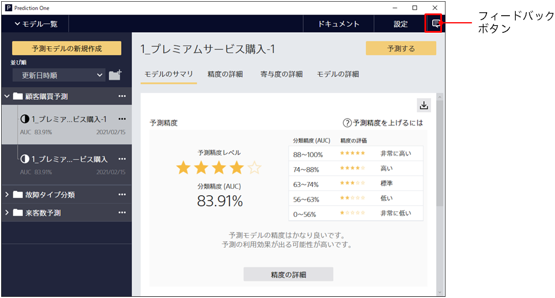
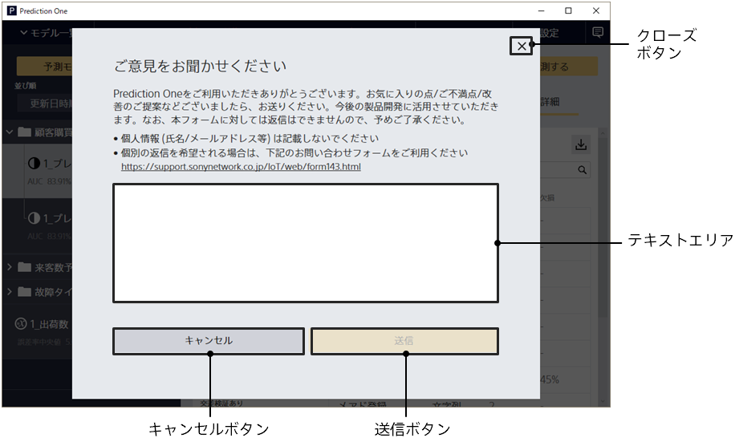

{}

Prediction One を起動した状態で右上にあるフィードバックボタンをクリックすると、フィードバック送信画面に遷移します。

フィードバック送信画面

{}
{}
{}
Prediction One を使用した際のご意見・ご感想をお寄せください。
<u>このフィードバック送信機能から送信された内容に対しては返信できませんので、あらかじめご了承ください。また、氏名・メールアドレス等の個人情報は記載しないでください。</u>
{}
{}

{}
