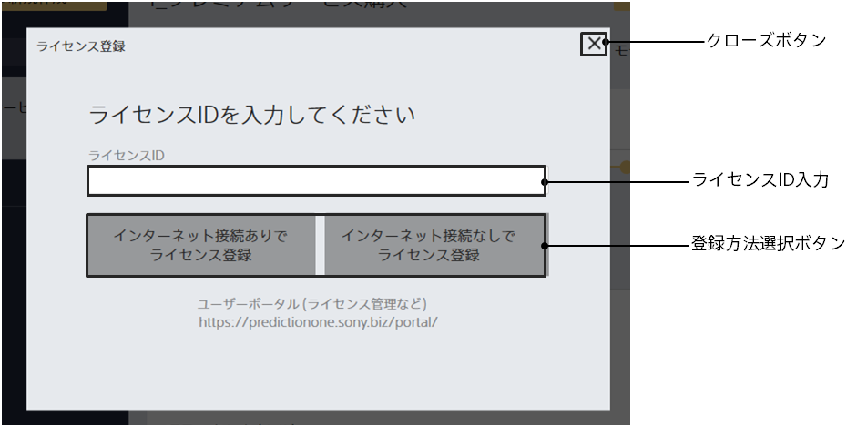

Clicking the [License Registration] button on the settings screen will take you to this screen.

{}
{}
{}
Please refer to the User Portal for details on how to register and purchase licenses.

{}
{}
{}

{}
{}
{}
{}
