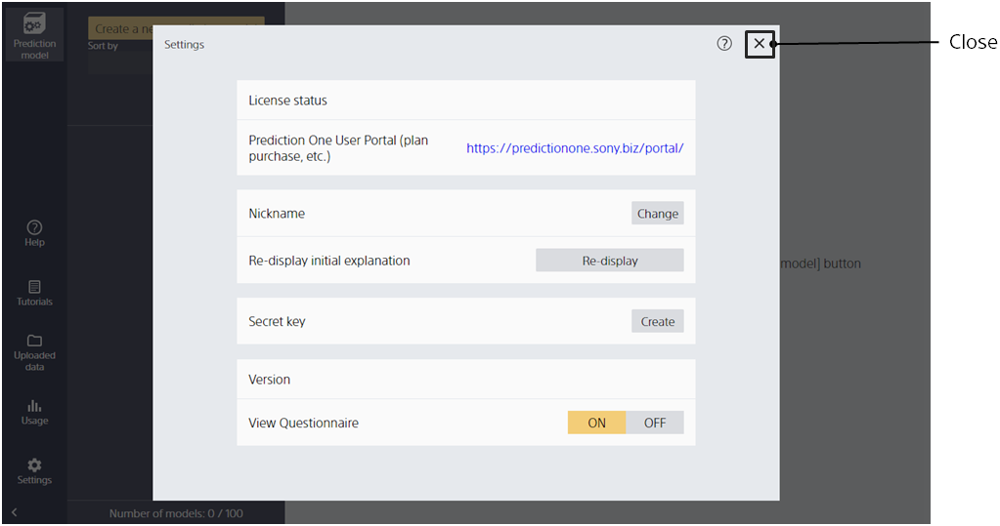
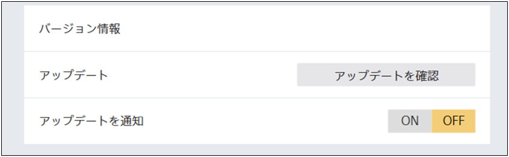
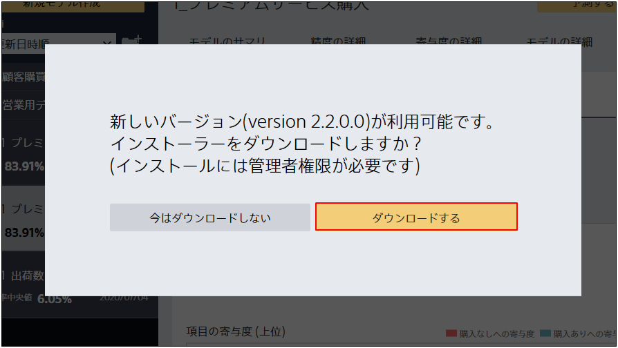
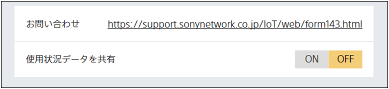

When Prediction One is running and you click [Settings], this screen will appear.

{}
{}
{}

{}
{}

A network connection is required to check for updates.
{}
{}

A network connection is required for updates.
{}
{}

{}
{}

A network connection is required to check for updates.
If you do not need the update notification, turn off the Update notification setting button.
{}
{}

{}
{}

To share usage data for software improvements, turn on the usage data setting button.
<u>Usage data is anonymous data about software usage. **No personal information or data sets are shared**.</u>
If you do not want to share usage data, turn off the usage data setting button.
{}
{}

{}
{}
{}

{}
{}
A workspace is a folder that contains information, such as Prediction One models.
{}
{}

{}
{}
{}
