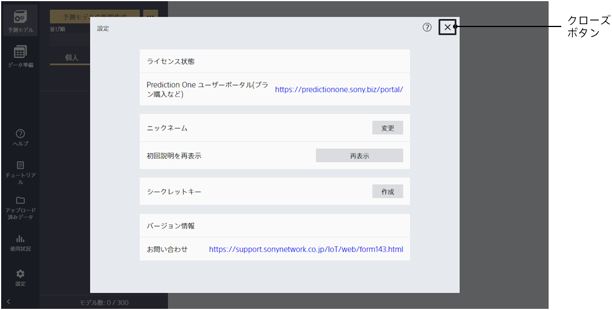
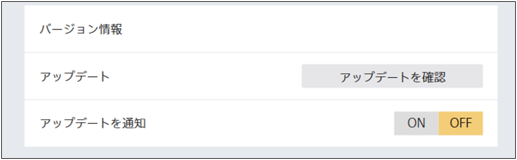
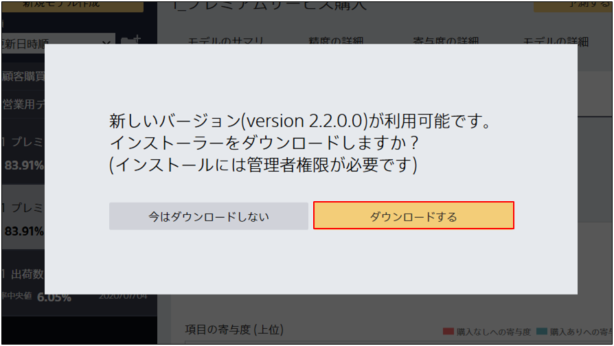
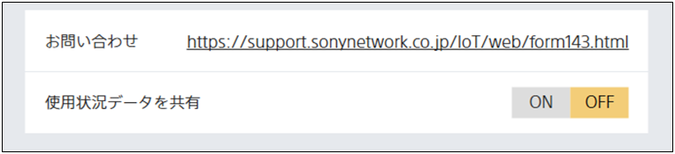
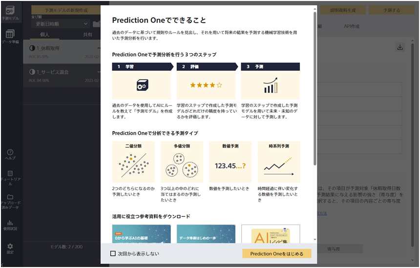

Prediction One を起動した状態で「設定」をクリックするとこの画面に遷移します。

{}

{}
{}
{}

{}
{}

アップデート確認にはネットワーク接続が必要です。
{}
{}

アップデートにはネットワーク接続が必要です。
{}
{}

{}
{}

アップデート確認にはネットワーク接続が必要です。
アップデートの通知が不要の場合は、アップデート通知設定ボタンを OFF にしてください。
{}
{}

{}

{}
{}

ソフトウェアの改善のために使用状況データを共有するには、使用状況データ設定ボタンを ON にしてください。
<u>使用状況データとは、ソフトウェアの使用状況に関する匿名データで、**個人情報やデータセットは一切共有されません**。</u>
使用状況データを共有しない場合は、使用状況データ設定ボタンを OFF にしてください。
{}
{}

{}
{}
{}

{}

{}
{}
{}

{}
{}
ワークスペースとは、Prediction One モデルなどの情報が格納されているフォルダーです。
{}
{}

{}
{}
{}
