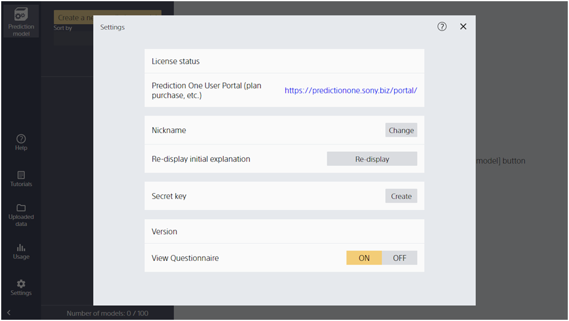

Clicking "Settings" takes you to this screen.

{}
{}
{}

{}
{}

{}
{}
{}
When a nickname is set, the nickname appears instead of the account ID on the data list screen.

{}
{}
For details, see "{}".

{}
{}

{}
{}
