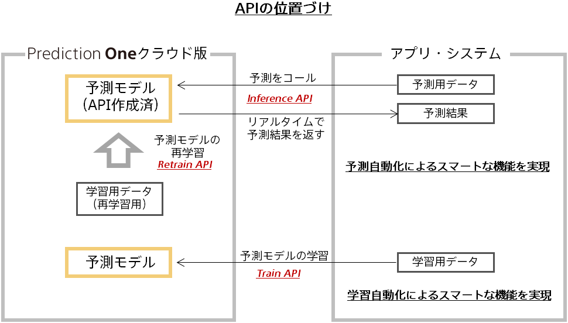

### API List

| No.  |  API Name     | Function Overview              |
| :--- | :--------- | :------------------  |
|1 | Get API Key| Retrieve the API key.|
|2 | Train Data Upload| Upload the data set for training.|
|3 | Train| Create a prediction model.|
|4 | Train Status Check| Retrieve the status of training.|

For information on the method for retrieving a secret key, see the "{}" page.

For information on the relationship between each API, see the figure below.

