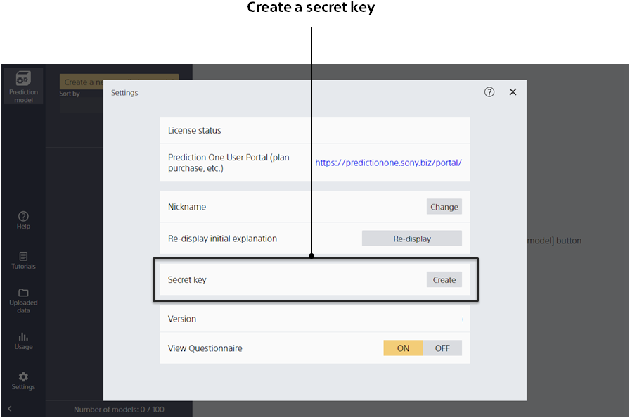

The secret key is retrieved on the settings screen.
Clicking the [Create API] tab of a created prediction model takes you to this screen.

Clicking [Settings] takes you to this screen.
Click [Create] for a secret key to retrieve the secret key.

{}
{}
{}
{}

