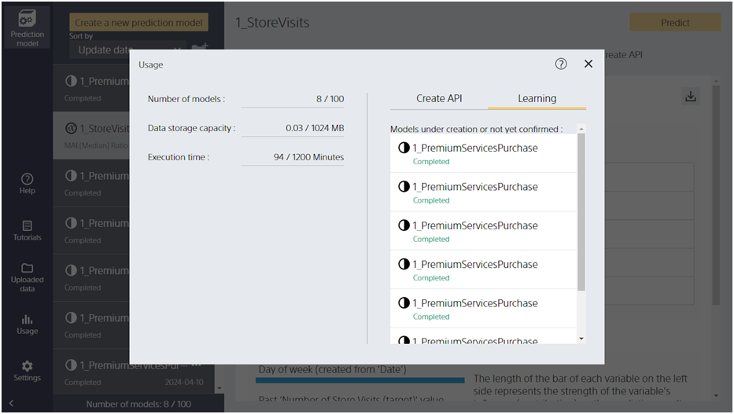

Clicking the "Usage" button takes you to this screen.

{}
{}
Creating a model increases the number of models by one. Models are counted separately for personal and shared use (which can be shared to the same tenant's account). You cannot create more than the maximum number of models. If the limit is about to be exceeded, delete the unused models.

{}
{}
The total amount of uploaded files is counted. Personal and shared (can be shared to the same tenant's account) are counted separately. If the total file size exceeds the limit, you will not be able to upload or share files.

{}
{}
The calculation time accumulates as the model is created. It is reset to zero when the month changes. In the free trial, the calculation time is counted without being reset even if the month changes. If the limit is exceeded, the model cannot be created.

{}
{}
{}

{}
{}
{}

