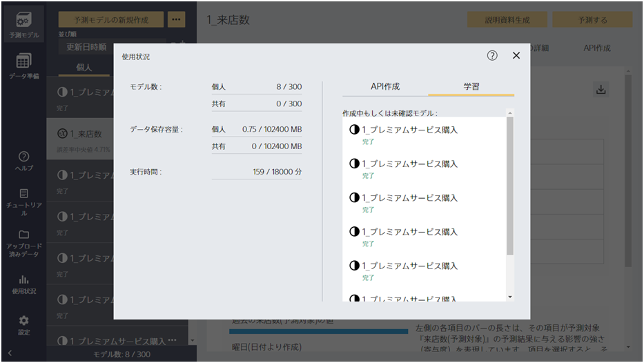

「使用状況」ボタンをクリックすると、この画面に遷移します。

{}
{}
モデルを作成するとモデル数が一つ増えます。モデル数には個人用と共有用（同じテナントのアカウントに共有できる）それぞれで別でカウントされます。上限を超える数のモデルは作成できません。上限を超えそうな場合は、使用しないモデルを削除してください。

{}
{}
アップロードしたファイルの容量の合計がカウントされます。個人用と共有用（同じテナントのアカウントに共有できる）それぞれで別でカウントされます。合計のファイル容量が上限を超える場合、ファイルのアップロードや共有は出来なくなります。

{}
{}
計算時間はモデル作成をするとそれにかかった時間が累積していきます。月が変わるとゼロにリセットされます。無料体験では月が変わってもリセットされずに計算時間がカウントされます。上限を超えるとモデル作成ができなくなります。

{}
{}
{}

{}
{}
{}

