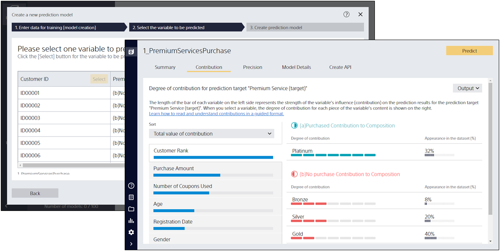
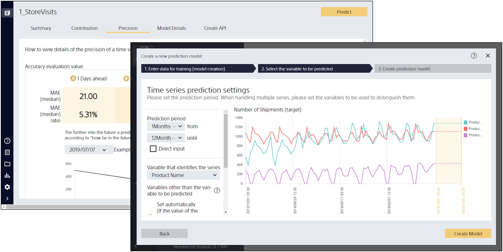
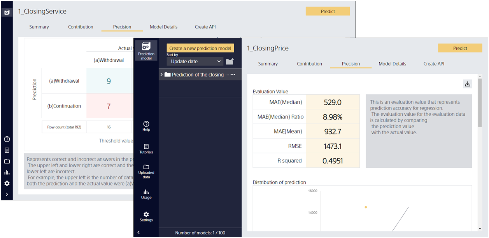

Prediction One is software that can perform predictive analytics without machine learning or programming skills. It combines ease of use and the predictive analytics capabilities required for business deployment with the following features:


{}
<small>\*The video may not be displayed due to a lack of network connection or other reasons.</small>
 
 
{}

- **High Accuracy**: Data pre-processing know-how and automatic modeling algorithms are implemented.
- **Easy to Use**: Design that eliminates technical words and takes into account user workflow.
- **Easy to Understand**: Visualize predictive contribution feature and rich predictive accuracy evaluation graph.

{}
- **Easy to Deploy**: Just install it on your PC to get started, and the desktop version doesn't require data upload to the cloud, making it easy to use confidential information.
{}

{}
- **Easy to Deploy**: Available right now on your web browser.
{}

Predictive analytics is a versatile technology that can be applied to a variety of business situations. However, due to the high level of expertise required, such as machine learning, there are hurdles to properly implement. Even if you're not a machine learning expert, Prediction One can help you consider introducing predictive analytics into your business.
