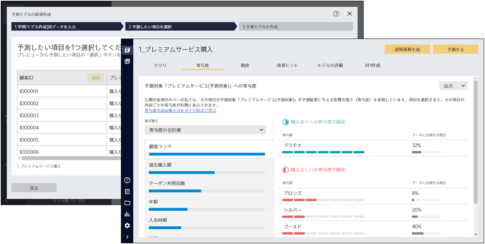
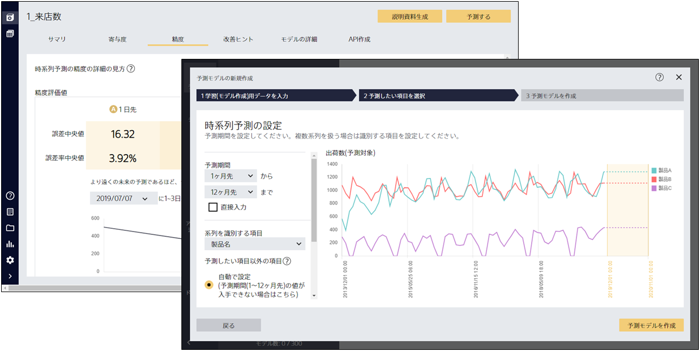
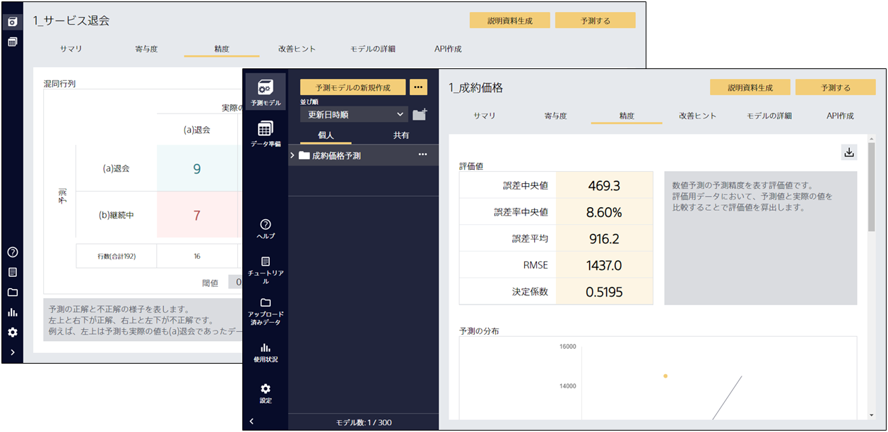

Prediction One (プレディクション ワン)とは、機械学習やプログラミングのスキルなしでも予測分析が実行できるソフトウェアです。以下の特長を持ち、使い勝手のよさと、ビジネス導入に必要な予測分析機能を両立しています。


{}
<small>※ネットワークが接続されていない等の原因によって、動画が表示されない場合があります</small>
 
 
{}

- **高精度**：データ前処理ノウハウ、自動モデリングアルゴリズムを搭載
- **使いやすい**：専門用語を排し、利用者のワークフローを考慮したデザイン
- **理解が容易**：予測寄与度を可視化する機能、豊富な予測精度評価グラフ

{}
- **導入が容易**：PC にインストールするだけで利用開始、またデスクトップ版はクラウド上へのデータアップロードは不要で社外秘情報も扱いやすい
{}

{}
- **導入が容易**： Webブラウザからすぐに利用可能
{}

予測分析は汎用性が高くさまざまなビジネスシーンに導入が可能な技術です。しかし、機械学習などの高い専門性を要するため、適切に導入するにはハードルがあります。Prediction One を利用すれば、機械学習の専門家でなくても、予測分析をビジネスに導入する検討を進められます。
