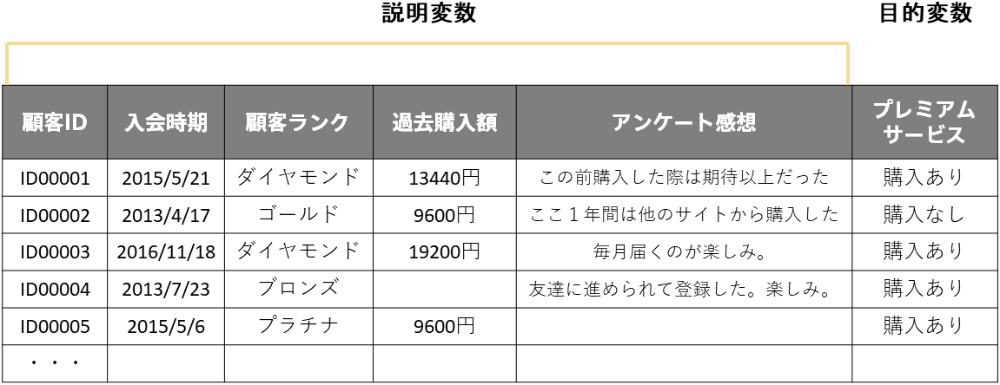

<!-- 参考資料 -->
<!-- https://www.stat.go.jp/teacher/dl/pdf/c4learn/materials/fourth/dai1.pdf -->

機械学習でデータからルールやパターンを見いだし未知のデータに対して予測させるプロセスには「<b>学習</b>」、「<b>評価</b>」、「<b>予測</b>」という3つのステップが必要です（評価を除いて「学習」と「予測」の2ステップと表現することもよくあります）。ここではこの3ステップについて詳しく説明します。 
  

  

データとして以下のようなマーケティングのデータがあったとします。ここでは顧客の情報からプレミアムサービスを購入してくれそうなのかどうか予測できると嬉しいのでこれを予測対象にします。つまり、プレミアムサービスの列が目的変数でそれ以外の列が説明変数です。 
  

  

機械学習モデルは顧客の情報とプレミアムサービスの購入あり/購入なしの間に存在するルールやパターンをデータの中から見いだします。これが「学習」です。 
  

  

一方、データの中にはプレミアムサービスの購入あり/購入なしがまだわからない顧客もいます。ルールやパターンを学習した予測モデルがこのような顧客に対して購入あり/購入なしの判断をするのが「予測」です。 
  

  

しかし予測モデルがデータから見い出したルールやパターンの良し悪しがわからないまま、予測モデルの出力した予測結果を活用できるでしょうか？多くの場合、実運用に耐えうるのかどうか確認できなければいけないため、どのくらいの精度で予測を当てられるのかを知りたくなります。つまり、この精度を確かめる「評価」のステップが「学習」と「予測」の間に必要になります。 
  

  

では、どのくらいの精度で予測を当てられるのか確かめるためにはどうすれば良いでしょうか？今、手元にはすでにプレミアムサービスの購入あり/購入なしが分かっているデータ、つまり学習に使ったデータがあるので、このデータに対してもう一度予測モデルに予測をさせて、その正誤を確認する方法が一つ考えられます。 
しかし、このような方法で予測モデルの良し悪しを判断するのは良くないことが知られています。 
  

  

データからルールやパターンを見い出す際に、機械学習モデルは内部の様々なパラメータを調整し、与えられたデータに当てはまりの良いパラメータを採用します（詳しくは「<b>{}</b>」）。これが、「データから見い出したルールやパターン」です。この「データから見い出したルールやパターン」が与えられたデータではうまく機能しても、それ以外のデータでは機能しないことがあります。 
簡単な例として小学生の身長（説明変数）から体重（目的変数）を予測するモデルを考えてみます。身長と体重の関係性はその生徒の健康状態など他の要因も関係してくるため、身長から体重を完全に求められないであろうことが想像され、ある程度の誤差を許容したルールを見い出すのが良さそうです。しかし、機械学習モデルは学習の際にあくまで与えられたデータのみからルールを見い出すので、与えられたデータへの当てはまりをよくするために極端なルールを見い出してしまうことがあります。 
もしこの学習に使ったデータを再度用いて機械学習モデルを評価すると、とても誤差の小さい良いモデルと評価してしまうことになります。しかし、このモデルに学習に使わなかった未知の新しいデータを入れると、全く体重を当てられないケースが多く存在するため良いモデルとは言い難いです。 
  

  

このように学習に使ったデータで予測モデルを評価すると本来考えられる関係性をうまくとらえられていないにも関わらず、評価上は誤差が小さく良いモデルに見えてしまう現象が起きることがあります。このように学習時に与えられたデータへの当てはまりは良いが本来の関係性はとらえられていないことを<b>過学習</b>しているといいます。一方で未知のデータに対する予測性能を<b>汎化性能</b>や<b>汎化能力</b>といい、汎化性能が高いモデルほど実運用に耐えうるモデルということになります。 
つまり、「評価」のステップではこの汎化性能を測定したいのですが、学習に使ったデータで予測モデルを評価すると汎化性能は測れないのは上記の通りです。つまり、学習に使ったデータで評価をするのではなく未知の新しいデータで予測モデルを評価すべきなのです。 
  

実際の流れは以下のようになります。まず手元にあるデータを学習に使うデータと評価に使うデータに分割します。このときの、学習に使うデータを<b>学習（用）データ</b>と、評価に使うデータを<b>評価（用）データ</b>といいます。 
  

  

そして学習用データのみを機械学習モデルに与えて学習させ、このとき機械学習モデルが見い出したルールやパターンの精度を予めとっておいた評価用データで評価します。 
  

  

評価用データをあらかじめ取り分けておくことで、疑似的に<b>正解が分かる未知の新しいデータ</b>による予測モデルの評価（つまり汎化性能の測定）ができ、極端なルールを見い出している（過学習している）モデルを性能が低いと評価できます。こうすることで本当に未知の新しいデータに対しても同等の精度で予測ができるであろうことが見込めます。 
  

  

