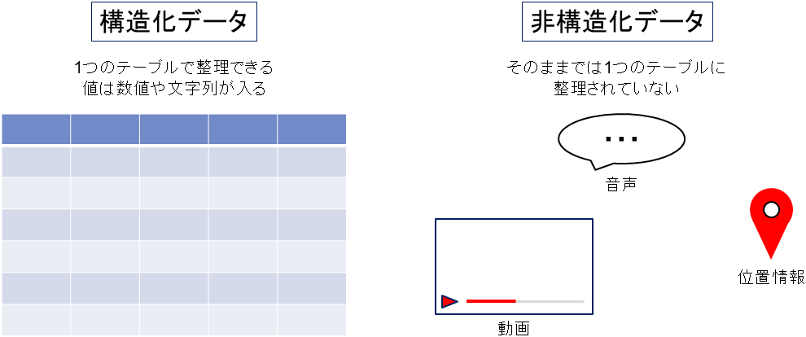
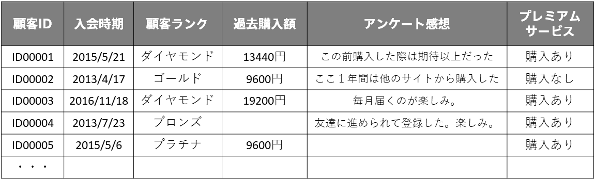
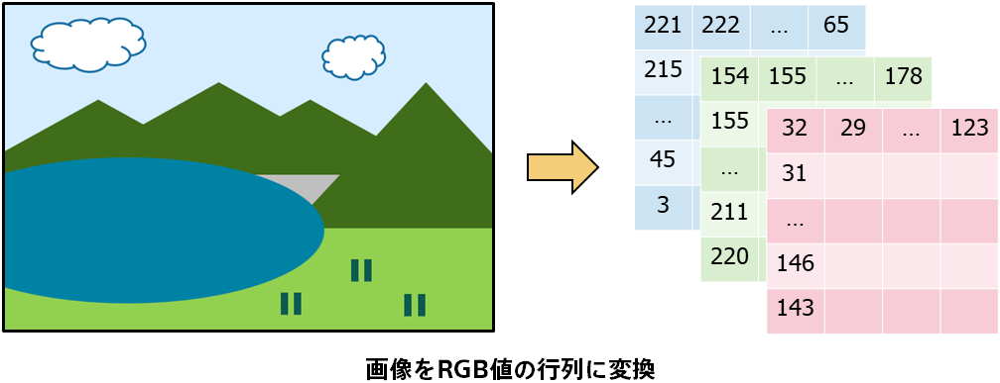

<!-- 参考資料 -->
<!-- https://www.stat.go.jp/teacher/dl/pdf/c4learn/materials/fourth/dai1.pdf -->
<!-- https://www.stat.go.jp/dstart/point/seminar/02/3-1.html -->

機械学習に必要なデータですが、データと言っても様々な種類があります。ここではデータの種類ついて紹介します。 
  

### 構造化データと非構造化データ

データはまず<b>構造化データ</b>と<b>非構造化データ</b>に大別されます。 
  

  
構造化データとは、行と列の形式で整理された表形式（テーブル）データのことです。ExcelやCSVファイルを想像していただければイメージしやすいかと思います。構造化データでは、行（レコード）は人や商品など一つひとつのサンプルを表しており、列（カラム）はそのサンプルの情報を同じ意味のものは同じ列に格納する形で表していることが多いです。 
  

  
一方、非構造化データとは、音声・画像・動画・テキストなど、そのままでは表形式でないデータのことです。非構造化データを機械学習に利用するためには、まずデータを前処理して構造化する必要があります。例えば、テキストデータを単語の出現頻度に変換したり、画像データをピクセル値に変換したりします。 
  

  
予測分析が対象としているデータ（Prediction Oneで扱えるデータ）は行と列の二次元、表形式で表すことのできるデータ（構造化データ）です。Prediction Oneでは、このような表形式データをCSVかTSVの形式で入力することができます。 
  

### 表形式データのデータタイプ

予測分析が対象としている表形式データでもその列ごとに含まれている情報の質は異なり色々なデータが存在します。様々な切り口でデータの種類を分類することができますが、ここではPrediction Oneでも使用している「日時」、「数値」、「文字列」、「テキスト」の4タイプでデータタイプを解説します。 
  

#### 日時

日時のデータタイプに含まれるのは「2024/09」や「2024-09-13 12:34:56」など、日付や時刻を表すものです。 
日時の情報には「それが何曜日なのか」、「その季節はいつなのか」といった情報が含まれています。 

#### 数値

数値のデータタイプに含まれるのは「2」、「139.48」など、数値で表すことができるものです。 
数値にはその値の大きさや順番に意味がある（1000円は100円より大きい or 10倍である）のが特徴です。 

#### 文字列

文字列のデータタイプに含まれるのは「ゴールドランク」「長野県」など、分類を表すものです。 
順番に意味はなくそのデータが属する分類を指し示すのが特徴です。 

#### テキスト

テキストのデータタイプに含まれるのは「購入から1週間で電源がつかなくなった」、「画面にドット欠けがある」といった、自然言語で情報が表されたものです。 
テキストデータは表形式データの1列に含めることはできますが、厳密には非構造化データに分類されます。構造化データとして機械学習で扱う際には「『電源』という単語が含まれているか」「『画面』という単語が含まれているか」という情報に置き換えて複数の列を用いて内容を表現する必要があります。 
  

発展的内容

「ゴールド」、「シルバー」、「ブロンズ」のように文字列でも順番に意味はあり、大きさに意味はない（ブロンズはゴールドの3倍、という解釈はできない）という数値のデータタイプに近い性質を持つものもあります。 
一方で数値でも「出席番号3番」「出席番号12番」のように順番にも大きさにも意味がない文字列のデータタイプに近い性質をもつものもあります。 
データの分類には「変数の尺度水準」というものがあり情報の種類により「名義尺度」、「順序尺度」、「間隔尺度」、「比尺度」に分けることができます。 
  

| 尺度 | 説明 | 例 | 
| :--------- | :------------ |  :--------- | 
| 名義尺度 | 分類を目的とした尺度で順番に意味がないもの | 出席番号、都道府県、など | 
| 順序尺度 | 順序にも意味があるが間隔は定かでないもの | 学年、ランク、順位、など | 
| 間隔尺度 | 順序尺度で間隔にも意味があるが、0に意味がないもの | 温度、時間、など | 
| 比尺度 | 間隔尺度で0に意味があり比率を計算できるもの | 金額、距離、など | 

※温度は水が氷る点を0℃と定めているだけで、例えば気温の6℃は3℃の2倍暑いといった解釈はできません。 
  

上記のうち「名義尺度」、「順序尺度」はカテゴリデータ（カテゴリカルデータ、質的データ）と、「間隔尺度」、「比尺度」は数量データ（量的データ）と呼ばれることもあります。 
Prediction Oneのデータの分類（「日時」、「数値」、「文字列」、「テキスト」の4タイプ）も説明しましたが、このうち「文字列」をカテゴリデータと、「数値」を数量データと解釈するアルゴリズムを採用しています。

