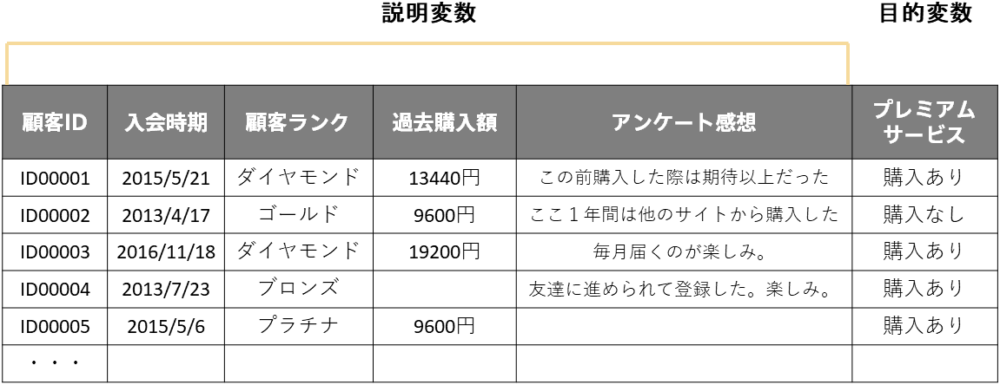
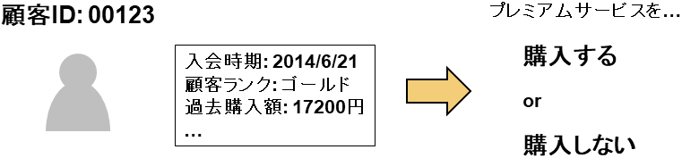
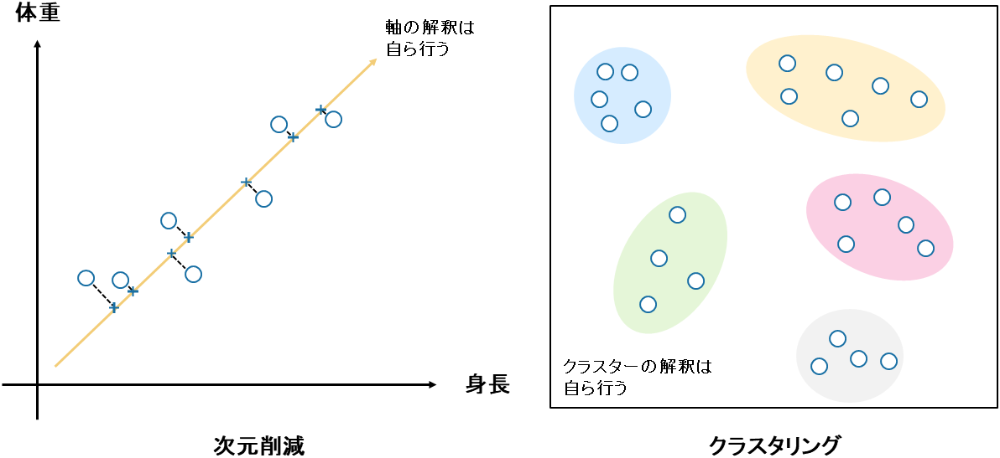

<!-- 参考資料 -->
<!-- https://www.stat.go.jp/teacher/dl/pdf/c4learn/materials/fourth/dai1.pdf -->

機械学習とはコンピュータがデータから自動的にルールやパターンを見い出す技術のことでした。機械学習はデータや解決したい課題の性質により大きく「<b>教師あり学習</b>」と「<b>教師なし学習</b>」の2つに分けることができます。 
  

### 教師あり学習

教師あり学習とは、入力データとそれに対応する正解ラベルがセットになったデータを用いて入力データと正解ラベルの間にある関係性をコンピュータに見い出させる手法です。「特徴を表すデータ」と「正解を表すデータ」がセットであることが前提となります。「特徴を表すデータ」のことを<b>説明変数</b>、「正解を表すデータ」のことを<b>目的変数</b>といいます。 
教師あり学習ではコンピュータが「特徴を表すデータ」である説明変数と「正解を表すデータ」である目的変数の間に存在するルールやパターンを見い出し、それを記憶します。そして新たに今まで見たことがない説明変数を与えられたとき、記憶したルールから目的変数を予測します。 
特にPrediction Oneでは表形式データのみを対象としています。ですので表形式データのうち一列を「正解を表すデータ」である目的変数として選び、それ以外を「特徴を表すデータ」である説明変数とします。
  

  
教師あり学習で扱う問題はさらに<b>分類問題</b>と<b>回帰問題</b>に分けられます。 
  
分類問題は、目的変数が「どのクラスであるか」を表すものであり、コンピュータは説明変数の情報から当てはまるクラスを予測します。例えば顧客のプロファイルや購買状況からプレミアムサービスを購入するか否かを分類したり、修理のお問い合わせを最適な担当者へ分類したりします。前者は目的変数が「購入あり」「購入なし」の2種類に分類されるため「<b>二値分類</b>」と呼ばれ、目的変数の値が3種類以上存在する場合は「<b>多値分類</b>」と呼ばれます。分類問題の目的変数は数値ではありません。数値に置き換えたとしても（例えば購入ありを1、購入なしを0に置き換えたとしても）その値に意味はないことが特徴です。 
  

  
一方、回帰問題とは、目的変数が数値でありコンピュータは説明変数の情報からその数値を予測します。所在地、築年数、建物面積などの情報から不動産物件の価格を予測したり、曜日や天気、近隣の住人数、駅の利用者数などの情報から店舗の売上金額を予測したりします。回帰問題の目的変数は連続した数値です。 
  

  
  

### 教師なし学習

教師あり学習では、「特徴を表すデータ」と「正解を表すデータ」がセットであることが前提となっていましたが、教師なし学習はデータに対して正解ラベルがない状態でルールやパターンを見つけるための手法です。 
教師なし学習の主な手法には<b>次元圧縮</b>と<b>クラスタリング</b>があります。 
次元圧縮は<b>次元削減</b>とも呼ばれ、多くの特徴（説明変数）を持つデータを、少ない特徴にまとめる手法です。これによりデータの扱いやすさが向上し、視覚化も簡単になります。高次元データ（例えば、100個の特徴を持つデータ）は人間には理解しにくいですが、2次元や3次元に圧縮するとグラフで表示でき、パターンや関係性が見やすくなります。 
クラスタリングはデータをいくつかのグループ（<b>クラスタ</b>）に分ける手法です。各クラスタ内のデータは互いに似ており、異なるクラスタのデータは異なる特徴を持ちます。 
  

  
教師なし学習で用いるデータには正解ラベル（目的変数）がないため、人間が分析結果を解釈し意味合いを与える必要があります。次元圧縮では圧縮された次元の意味合いを人間が考え、クラスタリングではそれぞれのクラスタにどんな意味があるのか人間が考えます。この意味合いの付与の作業を人間が行わなければならないため、データに関する知識が必要です。 
Prediction Oneでは教師なし学習を行えません。 
  


表形式データを対象にある一つの列（＝目的変数）を機械学習により予測する分析のことを「<b>予測分析</b>」と呼ぶこともあります。予測分析は教師あり学習です。 
Prediction Oneは予測分析ツールですので対象としているデータは構造化データである表形式データです（詳しくは「<b>{}</b>」）。表形式データを対象とした機械学習の中でもある一つの列（＝目的変数）の予測を試みる教師あり学習がPrediction Oneでできることですので、活用の際はこの問題設定にビジネス課題が落とし込めるのか注意が必要です。詳しい流れは「<b>{}▶{}</b>」で確認できます。

