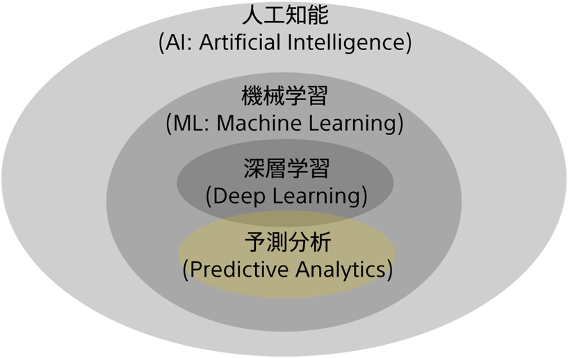

<!-- 参考資料 -->
<!-- https://www.stat.go.jp/teacher/dl/pdf/c4learn/materials/fourth/dai1.pdf -->

データサイエンスと聞くと、どんな単語を思い浮かべるでしょうか？ニュースなどで、<b>人工知能</b>（Artificial Intelligence, <b>AI</b>）、<b>機械学習</b>（Machine Learning, ML）、<b>深層学習</b>（<b>Deep Learning</b>, DL）といった用語は聞いたことはあるけど違いはよく分かっていない…といった方も多いと思います。まずはこれらの用語の関係性について整理していきましょう！ 
  
AI、機械学習、深層学習は以下のような包含関係にあり、外側の概念ほど古くから発見されていた技術になります。 
  

  
AIは「人間のような知的な活動を人間の代わりにコンピュータに行わせる技術」というような定義であることが多いです。AIが最初に注目されたのは1950年代と言われていて、当時は人間の知識を持ったコンピュータがその知識を持って推論することに論点を置いて研究がなされており、コンピュータに「学習能力を持たせる」という発想はありませんでした。ですので、人間の知識を人手でコンピュータにインプットしていると言えるでしょう。AIに含まれるものとしては例えば、人感センサーによるライトの自動消灯などがあります。 
  
「学習能力を持った」AIが機械学習です。機械学習では判断に必要な知識として様々なデータをコンピュータに与え、コンピュータがそこからルールやパターンを見いだし、まだ見ぬデータに対して予測を行う能力を獲得します。先ほどまでのAIとは違い、機械学習では、データさえ集めてしまえばあとはコンピュータが自動で知識を習得してくれます。機械学習に含まれるものとしては例えば、{}などがあります。 
  
最後に最も狭い概念であるものが深層学習です。機械学習の中には様々なモデル・アルゴリズム（＝データから知識を獲得し予測を行うための方法論）がありますが、その中でも人の脳のニューロンにおける情報伝達を模したモデルを用いたものが深層学習と呼ばれ、近年ブレークスルーを起こしているものになります。深層学習のモデルはそうでない機械学習のモデルと比べて学習に多くのデータとコンピューティングパワーを必要とする特徴があります。深層学習に含まれるものとしては例えば、顔認証システムなどがあります。 
  
予測分析ツールであるPrediction Oneはこの中でも機械学習と深層学習の技術を活用したツールです。
