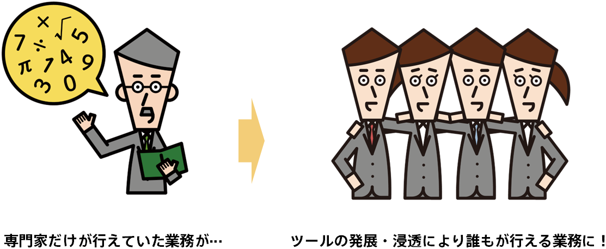

<!-- 参考資料 -->
<!-- https://www.stat.go.jp/teacher/dl/pdf/c4learn/materials/fourth/dai1.pdf -->

近年あらゆるITサービスの普及や既存システムのIT化により様々な分野でデータの収集が可能となっています。AmazonやGoogleといった米大手IT企業は先行的にビッグデータ活用に取り組み、自社の利益に変えてきました。 
現代社会において、このようなデータサイエンス技術・機械学習技術はその分野の学問を究めた限られた人のものではなく、誰もが必須で持っておくべきリテラシーともいわれています。 
大手企業による大規模ビッグデータでなくても手元のデータを用いたデータ活用施策は実行できます。 
例えば、飲食店などにおいて来客数は仕入れや在庫管理に影響を与えるため重要な指標です。過去の来客数や天気・気温・祝日・催事などの情報からデータサイエンスを用いて未来の来客数を予測し、仕入れや在庫管理を最適化できます。 
  
以前はこのようなデータサイエンス技術・機械学習技術の活用は、統計や情報科学の理解・プログラミングや数学の知識を必要としていたため、データサイエンティストや機械学習エンジニア、研究者などの専門家にゆだねられていました。しかし、近年では詳細な専門知識がなくとも機械学習モデルを構築することができる技術やサービスが浸透してきており、機械学習の技術をだれもが使える時代が始まっています。まさにPrediction Oneも非専門家が機械学習技術を活用するためのツールです。 
  

  
ただ、このような非専門家向けツールであっても、ある程度データサイエンスの概念を知っておかなければ最大限その能力を引き出すことはできません（もちろん複雑な数学やプログラミングの知識は必要ありません）。Prediction Oneを使って皆さんのビジネスを加速させていくのに大事な知識をここで学んでいきましょう。 
