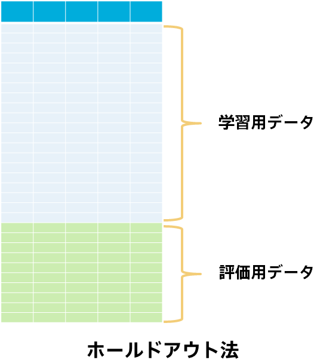
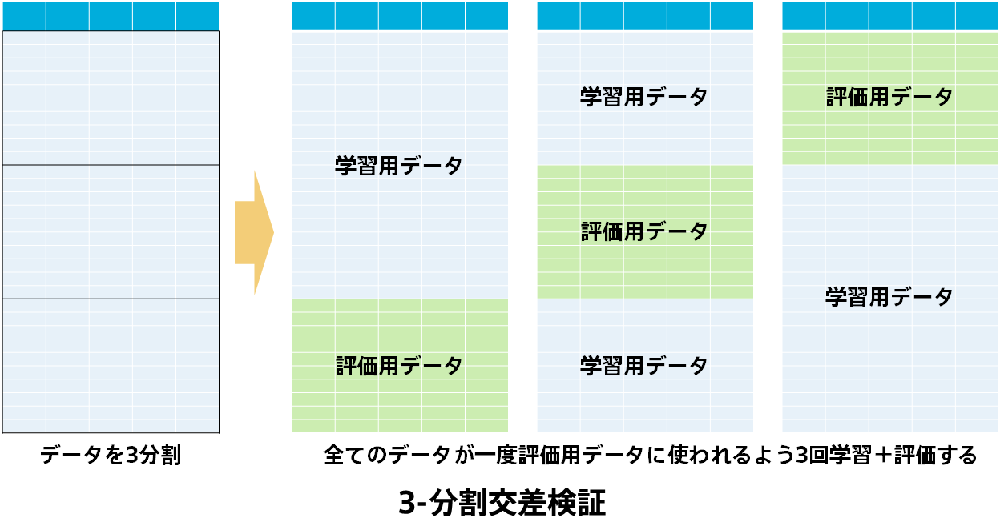
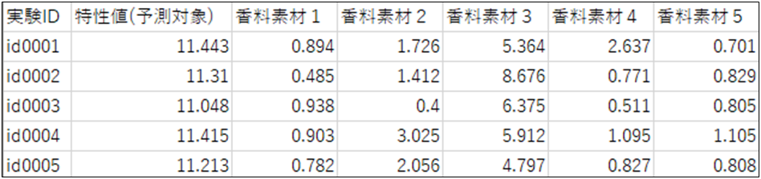
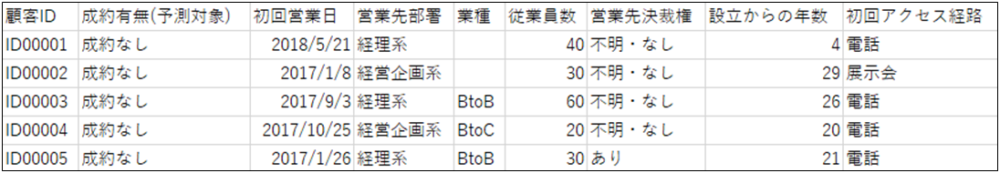

「<b>{}</b>」で、機械学習には「学習」、「評価」、「予測」のステップがあり、汎化性能（未知のデータに対する予測性能）を測るためにあらかじめ評価用データを取り分けておくことの必要性を説明しました。 
ここではどんな評価方法があるのか、評価用データを選ぶ際に気を付けるべきことについて説明します。 
  

### 評価方法の種類

#### ホールドアウト法

<b>ホールドアウト法</b>は最も基本的な評価用データの取り分け方です。ホールドアウト法は「<b>{}</b>」のように手元にあるデータの一部を評価用データとし、残りを学習用データとする方法です。 
こうすることで未知のデータに対する予測性能を測ることができます。評価用データにどの程度の割合を取り分けておくかは様々ですが1～5割とすることが多いです。 
  

  

#### 交差検証（クロスバリデーション）

<b>交差検証</b>（<b>クロスバリデーション</b>、Cross Validation、CV）はホールドアウト法をデータを取り換えて何度も行う方法です。行う回数に応じて、3-分割交差検証や5-分割交差検証と呼ぶこともあります。 
3-分割交差検証の場合、以下の図のようにまずデータを3分割します。このうち1つを評価用データ、残りを学習用データにする作業を3回行い、全てのデータが一度評価用データとして使われるようにします。そしてすべてのデータに対する評価時の予測と実際の値を比べて評価をします。 
  

  
交差検証はデータが少ない場合に有効な評価方法です。 
例えばデータ数が300行しかない場合にホールドアウト法で1割を評価用データに取り分けて予測モデルを評価するとします。つまり評価用データは30行です。このとき選ばれた30行がたまたま変わったデータで、予測するのがとても簡単だったり難しかったりすると、不当に高く評価したり、不当に低く評価したりしてしまいます。データが少ないと変わったデータばかりが評価用に選ばれてしまう確率が上がってしまい、評価が安定しにくくなります（データが3000行あり300行が評価用データとなる場合は、この300行のデータが変わったデータばかりになる可能性は30行の場合の例と比べると低くなります）。 
交差検証を行うとすべてのデータを一度評価用データに用いることができるので評価が安定しやすくなります。 

発展的内容

評価は本当に未知の新しいデータに対する予測性能、つまり本番での予測モデルの性能を見積もるために行うと「<b>{}</b>」で説明しました。しかし、交差検証では予測モデルが分割数分できてしまいます。この場合本番の予測モデルには何を使えばよいのでしょうか？ 
代表的な方法は2つあります。 
1つは交差検証でできた予測モデルを全て用いる方法です。この方法では、未知の新しいデータに対してすべての予測モデルに予測を行わせ、その結果の平均や多数決を最終的な予測結果とします。 
もう1つは交差検証はあくまで安定した評価のため（=本番での予測性能をなるべく正確に見積もるため）に行うにとどめ、本番のモデルにはすべてのデータを用いて学習しなおした予測モデルを採用する方法です。「<b>{}</b>」で紹介した通り、機械学習モデルには過学習により本番での性能が低くなってしまう現象があります。ですので、学習をし直す時に過学習が起きないよう、交差検証の際に発見した良いハイパーパラメータ（詳しくは「<b>{}</b>」の発展的内容）を用いて学習をし直します。過学習の主な原因は悪いハイパーパラメータを使ってしまうこと（データから決定するパラメータではない）なので、このような方法で過学習を防ぐことができます。

  

### 評価用データの選び方

汎化性能（未知のデータに対する予測性能）を測るためにあらかじめ評価用データを取り分けておくことの必要性は上記の通りですが、どのようにデータを分割して評価用データを取り分けておくとよいでしょうか？端的にこの質問に答えると、「本番と近い状況を再現できるように手元のデータを学習用データと評価用データの分割する」のがよいです。 
  
例えば今までの化学材料の特性値に関する実験データから予測モデルを作成し、これから実験する化学材料の特性値を予測したい場合を考えてみます。以下はデータのイメージです。 
  

  
このようなデータでは、各実験は独立に行われていて前後関係や時間的なトレンドなどはないことが考えられます。つまりid0001とid0002の実験をする順番を変えると結果（特性値）が変わることもなければ、3か月前に行った実験より1か月前に行った実験の方が香料素材の値にかかわらず特性値が高く出やすいといったこともないことが考えられます（実験の手順に問題がない場合）。 
このケースでは評価用データはデータから満遍なく抽出するのが良いと考えられます。ですのでデータからランダムに評価用データを選ぶとよいでしょう。評価を安定させたい場合は交差検証なども有効な手段となります。 
  
一方で今までの成約実績から予測モデルを作成し、来年度に営業をかけるときに成約の見込みが高い顧客を予測したい場合を考えてみます。以下はデータのイメージです。 
  

  
このようなデータはその業界におけるトレンドの変化などによりデータの傾向が年度ごとに異なるような可能性があります。 
例えば現在が2024年だとして2010年～2024年のデータが手に入っており、2025年の見込み客を予測したいとします。評価用データをランダムに抽出すると、例えば2020年のデータは学習用データにも評価用データにも含まれることになります。 
一方、現実では2024年現在に2025年のことを予測しようとしており、かつ毎年傾向が変わる可能性があります。 毎年傾向が変わる可能性がある状況において、2024年までの情報から2025年を予測することは難しいと考えられますが、 ランダムに抽出する方法だと、例えば2020年のデータの一部を知ったうえで（学習したうえで）2020年の残りのデータを評価用データとして評価しています（同じことがすべての年で起こります）。ですので、現実の難しさを反映していない評価方法となり、予測モデルの性能が過大評価されてしまいます。 
このような場合は、例えば、2021年までのデータを学習用データに、2022年、2023年、2024年のデータを評価用データにしてみましょう。 こうすることでより「本番と近い状況」で評価を行えることになります。全てのデータを評価用データとして用いる交差検証はあまり有効な評価方法にはなりません。 
（その業界で年度ごとのトレンドはほとんどないと考えられる場合は、特に気にせずランダムに評価用データを抽出して大丈夫です。この場合は交差検証による評価も有効です。） 
  

このようにデータの特性によって適切な評価方法は変わります。「本番と近い状況を再現できるように手元のデータを学習用データと評価用データの分割する」ためには、そのデータに関する知識が必要です。
