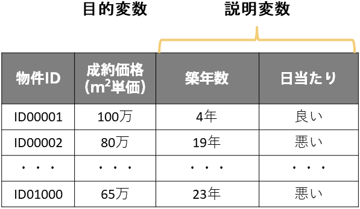
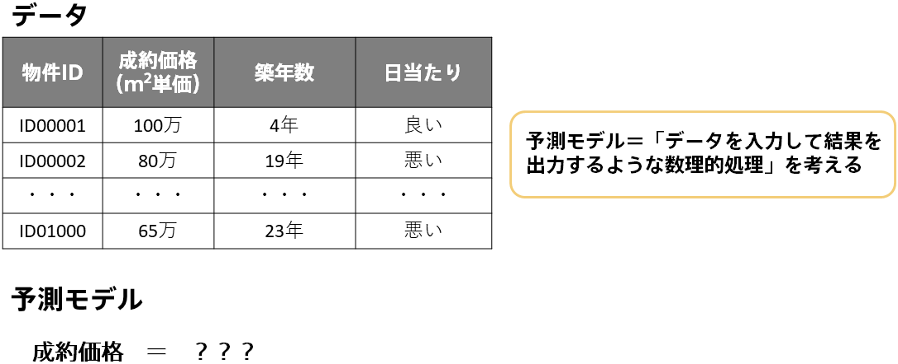
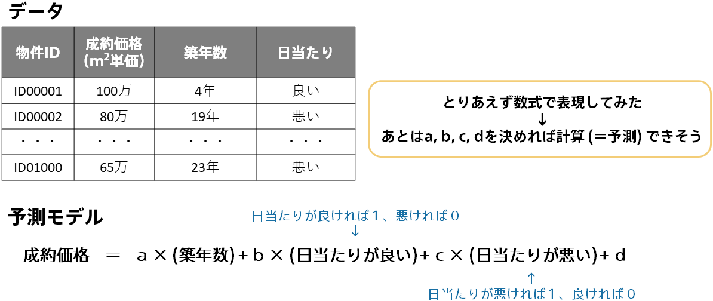
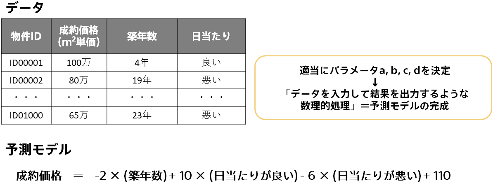
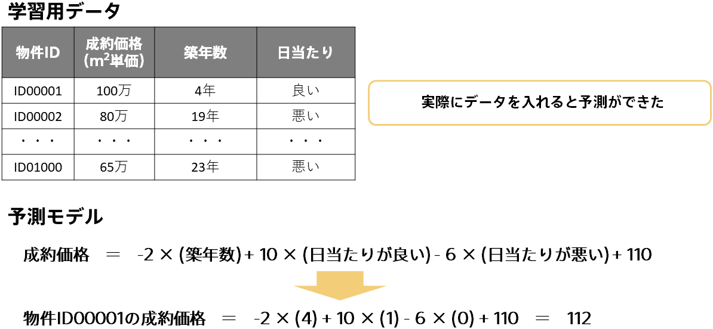
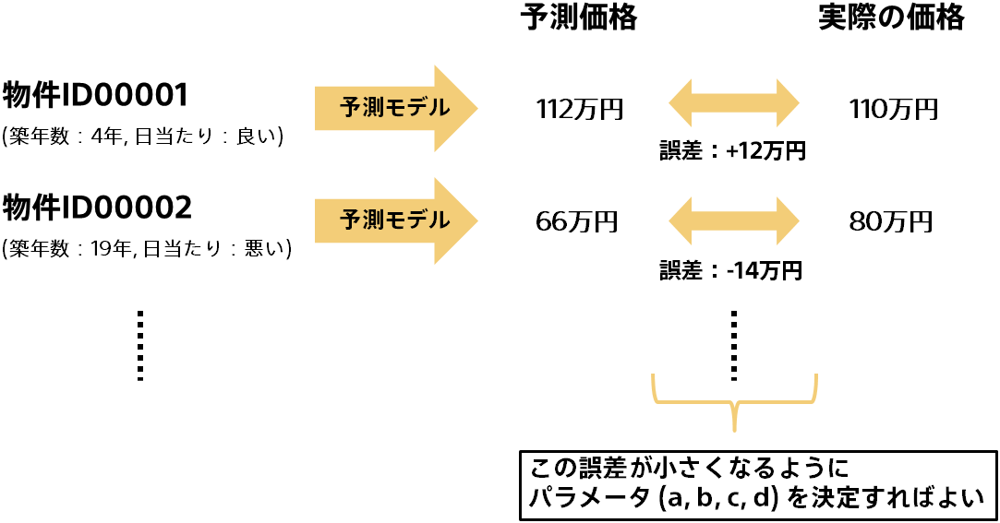

<!-- 参考資料 -->
<!-- SCKセミナー資料 -->

データから自動的にルールやパターンを見い出すことを「<b>学習</b>」、未知の新しいデータに対してこのルールやパターンを適用することを「<b>予測</b>」といいます（参考：「<b>{}</b>」）。ここではこの「学習」や「予測」といった機械学習の仕組みについて不動産の成約価格予測を例に簡単な式を用いながらイメージを説明します。 
  

  

見い出したルールやパターンをもって予測を行うものを<b>機械学習モデル</b>や<b>予測モデル</b>または単に<b>モデル</b>と呼ぶことがあります。予測モデルにおける「予測」はコンピュータによる処理ですので、内部的には数字の大きさの大小比較や四則演算による数理的処理によって行われます。つまり予測モデルとは「データを入力して結果を出力するような数理的処理」です。では不動産のデータを入れて成約価格を出力するような数理的処理としてどんなものが適切でしょうか？ 
  

  

色々な数理的処理が考えられ特にこれといった正解はないですが、ここでは簡単に以下のような式を考えてみました。「成約価格＝ a × (築年数) + b × (日当たりが良い) + c × (日当たりが悪い) + d」という式です。あとはこの a, b, c, d を決めれば実際に不動産の成約価格を計算できる、つまり予測モデルが完成します。 
ここで登場した「a, b, c, d」は<b>パラメータ</b>と呼ばれるものです。機械学習はデータから自動的にルールやパターンを見い出す技術と説明してきましたが、この「ルールやパターン」の実態は「a, b, c, d」のようなパラメータ、つまり複数の数値なのです。 
  

  

パラメータ「a, b, c, d」を決めれば予測モデルが完成しますが、このパラメータはどのように決めればよいでしょう？適当にそれらしい値として、a = -2, b = 10, c = -6, d = 110 という値を入れてみました。まず、成約価格の基準値のような役割として d = 110 としました。他は基準値からの調整項として、築年数は増えるほど価格が下がりそうなので a = -2 を、日当たりは良ければ価格が上がり悪ければ価格が下がりそうなので b = 10, c = -6 を入れてみました。 
予測モデルとは「データを入力して結果を出力するような数理的処理」であったことを思い出すと、この式に築年数や日当たりのデータを入れると成約価格という結果を出力できるので、これで予測モデルの完成です。 
  

  

では予測モデルができたので実際に予測をしてみます。物件ID00001は築年数が4年で日当たりが良いので、「成約価格＝ -2 × (4) + 10 × (1) - 6 × (0) + 110 ＝ 112万」となります。実際の成約価格は100万なので誤差12万で予測ができたことになります。 
  

  

適当にそれらしい値として決めた a = -2, b = 10, c = -6, d = 110 というパラメータで、物件ID00001は誤差12万で予測ができましたが他の物件ではどうでしょう？これは良いパラメータだったのでしょうか？果たしてこの予測モデルは良い予測が行えるのでしょうか？ 
一般的に正確に（＝誤差が小さく）予測できるモデルが良い予測モデルと考えられます。ですので、データ全体に対して実際の値と予測の値の誤差をそれぞれ計算しそれらが小さいモデルが良い予測モデルです。つまり誤差が小さくなるようにパラメータを決定すればよいということになります。 
  

  

実際に、機械学習における「学習」のステップではデータに対して誤差の小さくなるパラメータを探索します。 
様々な手法がありこの資料の範囲外となるため詳しくは説明を省きますが、1つ簡単な方法として以下が挙げられます。
- まず a, b, c, d をランダムに決定する
- これを100回繰り返し100個の予測モデルを作成する
- それぞれの予測モデルでデータ全体に対する誤差を計算し、最も誤差が小さかったパラメータを採用する
 

無駄な計算が多くなってしまうので実際にはこのような手法が使われることはないですが、基本的な原理としては「データに対して誤差が小さくなるパラメータを決定すること」が学習であり、これが機械学習がデータから自動で見い出した「ルールやパターン」に当たります。 
  

機械学習の仕組みに関する簡単な説明は以上になります。「データから自動的にルールやパターンを見い出す」というと何かロボットのような人工知能が勉強をしているようなイメージが浮かんでしまいますが、中身はこのページで紹介した数式のような数理的処理で表されていて、パラメータ（a, b, c, d）が「ルールやパターン」の実態でした。そして「学習」とは良いパラメータをデータから自動で決定すること、「予測」とは未知のデータに対して決定したパラメータを用いた計算結果を出力することです。 

発展的内容

パラメータにはこのページで紹介した学習時に調整されるパラメータのほかに、事前に決定しておく<b>ハイパーパラメータ</b>というものがあります。ハイパーパラメータはどのような挙動の機械学習モデルを使うのかを決定するもので、学習時にこのハイパーパラメータが変わることはありません。ハイパーパラメータは数値とは限りません。 
  
例えば今回、 
「成約価格＝ a × (築年数) + b × (日当たりが良い) + c × (日当たりが悪い) + d」 
という築年数に対して線形の挙動をする（築年数が1増えたら成約価格がa増える）予測モデルを使いましたが、 
「成約価格＝ a × (築年数<b>の2乗</b>) + b × (日当たりが良い) + c × (日当たりが悪い) + d」 
というような非線形の（線形でない）予測モデルも考えられます。このときのハイパーパラメータは「線形 or 非線形」となります。 
つまり大雑把に、ハイパーパラメータは機械学習モデルの設定値である、とも捉えられます。 
  
ここではハイパーパラメータとして簡単な例を用いましたが、実際は多くの種類と取りえる値があります。また、ハイパーパラメータは学習時に調整されないため、どんなハイパーパラメータが適切であるのか？といった調整作業を、学習とは別のプロセスで行うこともあります。例えば、ハイパーパラメータの候補を複数用意しておき、その候補の数だけ学習を行い最も良い予測を行えた候補を採用する方法などがあります。 
  
Prediction Oneではハイパーパラメータの調整も内部で自動的に行っているため、特に気を遣う必要はありません。

