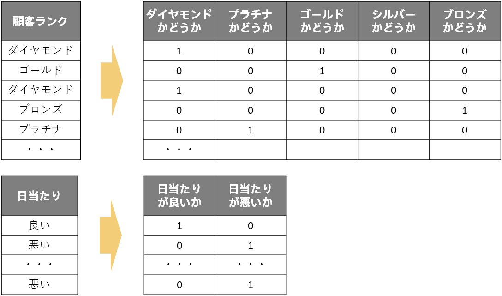
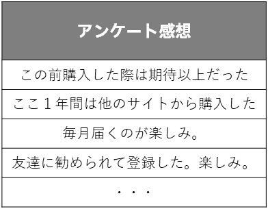

<!-- 参考資料 -->
<!--  -->

機械学習が見い出すルールやパターンの実態はパラメータという数値であり、この数値を用いた計算の結果として予測が得られると説明してきました（詳しくは「<b>{}</b>」）。また予測分析に利用できるデータタイプには「日時」、「数値」、「文字列」、「テキスト」があることを説明しました（詳しくは「<b>{}</b>」）。 
データタイプのうち「数値」については、そのままパラメータと大小の比較や四則演算が可能です。しかし、他のデータタイプでは直接パラメータと大小の比較や四則演算ができません。ここでは、機械学習でどのように数値以外のデータを利用しているかの説明します。 
  

「<b>{}</b>」で機械学習におけるデータに対する予測の中身は数値の大小比較や四則演算などの数理的処理と説明しました。つまり機械学習で予測（と学習）を行うためには与えられたデータを全て数値に変換して表現しなければならないということになります。データタイプの「日時」、「数値」、「文字列」、「テキスト」について、「数値」はそのまま利用できますが、他のデータタイプは直接利用できません。これらのデータを機械学習に利用するためにどのように数値で表現しているのか、それぞれのデータタイプごとに説明します。 
  

  

### 文字列

文字列とは以下のようなデータのことでした。 
  

  

このようなデータは列内に同じ値が何度も出てくるのが特徴です。例えば顧客ランクなら「ダイヤモンド」、「プラチナ」、「ゴールド」、「シルバー」、「ブロンズ」の5種類、日当たりなら「良い」、「悪い」の2種類、の値が複数の行に存在します。ですので「<b>{}</b>」の「成約価格＝ a × (築年数) + b × (日当たりが良い) + c × (日当たりが悪い) + d」という式での説明のように、ある値を取れば1、そうでなければ0と変換することで数値で同じ情報を表現できます。機械学習の分野では、これを<b>One-Hotエンコーディング</b>（ダミー変数化）と言い、0と1で表現された列（変数）のことを<b>ダミー変数</b>といいます。 
  

  

### テキスト

テキストとは以下のようなデータのことです。 
  

  

テキストも文字列のようにOne-Hotエンコーディングすれば良いでしょうか？実はテキストは単純にOne-Hotエンコーディングをしても機械学習ではうまくいきません。 
テキストは列内に同じ値が複数回出てくることは（滅多に）ありません。ですので単純にOne-Hotエンコーディングをすると各ダミー変数（各列）はある1つの行で1を取り、それ以外の行では0を取るということになります。 
  

  

このように表現すれば情報は完全に表せていますが、機械学習はこのデータからルールやパターンを見つけることができなくなってしまいます。例えば文字列の場合は「ダイヤモンドかどうか」という列の値が1の行が複数行あるので、これが1だったら購入しやすいという傾向が分かります。一方でテキストは「この前購入した際は期待以上だった」という列の値が1の行は1行しかなく、これが1だったからといって購入しやすいのかどうかの傾向を判断できません。 
  

  

ルールやパターンを見い出すには文字列の時のようにダミー変数が1の値を取る行が複数あるような変換であればよいということになります。そのため、頻出語に着目してその単語が含まれるかどうか、をダミー変数として追加するというOne-Hotエンコーディングが古典的によく行われる方法です。 
このような変換では元の情報を完全に表せていない（ダミー変数から元のデータを復元できない）ですが、単純なOne-Hotエンコーディングよりも機械学習でルールやパターンを見い出すのが容易になります。 
※大規模な計算リソースにアクセスできる場合は近年発達が目覚ましい大規模言語モデル（LLM）を使用する方法も考えられます 
  

  


文字列、テキストにかかわらず、作成されたダミー変数（列）で1の値を取る行が1行～数行のみと少ない場合、そのダミー変数はルールやパターンを読み取れない使い物にならない説明変数となってしまいます。文字列でも列内のユニーク数（値の種類の数）が行数に対して多いと、作成されるダミー変数がこのような使い物にならないものとなってしまう可能性があります。このような場合は似たような文字列を一つにまとめる（「快晴」、「晴れ」はどちらも「晴れ」にする、など）といった処理をすることで、機械学習がルールやパターンを読み取りやすいようにすることがあります。


### 日時

日時とは以下のようなデータのことです。 
  

  

日時もテキストのようにユニーク数が多くなると考えられます。また日時はその文字列自体や含まれる単語だけでなく、それが何曜日なのか？季節はいつなのか？といった情報も含まれており、こちらの方が予測したい情報との関連性が高いことも多いです（例えば週末は入電数が少ない、など）。 
なので日時についても単純なOne-Hotエンコーディングをするのではなく、曜日や季節といった特徴をダミー変数として用いることが機械学習ではよく行われます。 
  

  

