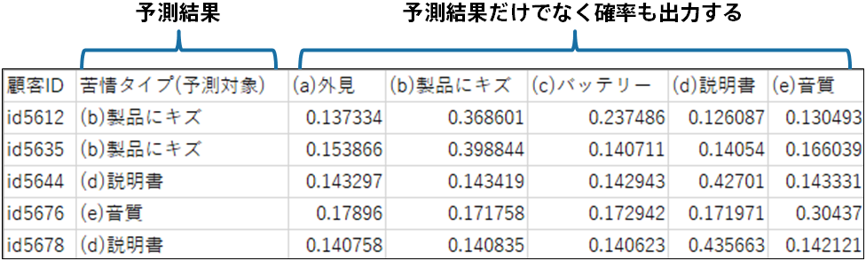

<!-- 参考資料 -->
<!-- https://www.stat.go.jp/teacher/dl/pdf/c4learn/materials/fourth/dai1.pdf -->

機械学習は教師あり学習と教師なし学習に大別されること、Prediction Oneは表形式データに対する教師あり学習に対応していることを説明してきました。また、教師あり学習には分類問題と回帰問題があると説明しました（詳しくは「<b>{}</b>」）。 
Prediction Oneではこれらをさらに分けて「<b>二値分類</b>」、「<b>多値分類</b>」、「<b>数値予測</b>」、「<b>数値予測（時系列予測）</b>」の4つの予測タイプが用意されています。これからそれぞれどのような特徴を持っていてどういった場面で選択すべきかについて説明します。 
  

  

### 二値分類

二値分類は目的変数が二種類の値しか持たない場合に該当する予測タイプです。例えば、プレミアムサービスの「購入あり/購入なし」、機器の故障における「故障/正常」などです。 
  

  
二値分類の特徴として予測モデルがどちらになる確率がどの程度かといった確率を出力する点があります。なのでこの確率をもとに、例えば購入の確率が高い顧客順に何か施策を行う、といった活用が可能です。詳しくは二値分類のチュートリアルを参考にしてみてください。 
  

  

二値分類のチュートリアル

- {}
- {}
- {}
- {}
- {}
- {}
- {}
- {}

### 多値分類

多値分類は目的変数が3種類以上の値を持ち、かつ数値でない場合に該当する予測タイプです。例えば、お問い合わせの自動分類、修理依頼の各担当者への自動振り分け、などが挙げられます。 
  

  
多値分類も二値分類と同様にどのクラスに振り分けられるのかの確率が出力されるため、これを活用することも可能です。 
  

  

多値分類のチュートリアル

- {}
- {}

### 数値予測

数値予測は目的変数が大小関係に意味を持つ数値（分類を表すような番号ではないという意味）である場合に該当する予測タイプです。例えば、不動産の成約価格予測、化学材料の物性値予測、などが挙げられます。 
  

  
数値予測の予測結果は数値になります。業務に導入する際は、この数値の予測結果を使った活用方法を考える必要があります。 
  

  

数値予測のチュートリアル

- {}
- {}
- {}
- {}

### 数値予測（時系列予測）

時系列予測は、目的変数が大小関係に意味を持つ数値（分類を表すような番号ではないという意味）であり、かつ時間に沿って並べた場合に前後に関係が見られる（前後関係に意味がある）場合に該当する予測タイプです。例えば、店舗における来店数予測、製品の出荷数予測、などが挙げられます。 
  

  
時系列予測の予測結果も数値になります。時系列予測では予測よりも、上振れたとしてどの程度まで上振れそうか、下振れたとしてどの程度まで下振れそうか、といった値も出力でき、上の例の来店数や出荷数の見積もりに活用できます。 
  

  

数値予測（時系列予測）のチュートリアル

- {}
- {}
- {}
- {}

### 予測タイプの使い分け

#### 二値分類と多値分類

予測したい項目（目的変数）に入っている情報が分類を表すものである場合は二値分類か多値分類が適切です（分類の種類が2つのみの場合は二値分類で3つ以上の場合は多値分類）。 
多値分類の場合は、目的変数のユニーク数、つまり分類（カテゴリ）の数に注意が必要です。例えばデータ数が500行しかないのにユニーク数は200ある場合、1つのカテゴリには大体2～3行分のデータしか存在しないことになります。機械学習モデルはデータを数値で表現する関係上、すべてのカテゴリを全く違うものと認識して学習を行います（詳しくは「<b>{}</b>」）。仮に200のカテゴリの部分部分に意味的に近いものがあった場合でも、機械学習モデルにとってそれは全く異なるものであるため（ダミー変数の表現では意味合いの近さを捉えられないため）、1つのカテゴリの傾向を把握するためのサンプルが2～3しか存在せず、ルールやパターンを見い出すのが非常に難しくなってしまいます。こういった場合は意味的に近いカテゴリを1つにまとめてユニーク数を減らす必要があります。 
どの程度までユニーク数を減らす必要があるかは要求される精度やデータの質・量に依存してきてしまうため実際に予測モデルを作成してみて確かめていく必要があります。データ上はユニーク数が3以上でも、多値分類のように細かい分類が必要ない場合は、大まかな分類として二値分類まで粒度を落として予測モデルを作成した方が良い精度が出やすいです。

#### 数値予測と時系列予測

予測したい項目（目的変数）に入っている情報が大小に意味のある数値である場合は数値予測が適切です。数値予測には通常の数値予測と時系列予測モードの2つがあります。時系列予測モードを使用すると、過去の出荷数や時間情報（季節・曜日・午前や午後などの時間からわかる情報）を利用した予測をするようになります。 データを時間に沿って並べてみたとき、予測したい項目の並びに時間的な関係がある場合、時系列予測モードをご利用ください。 
  

