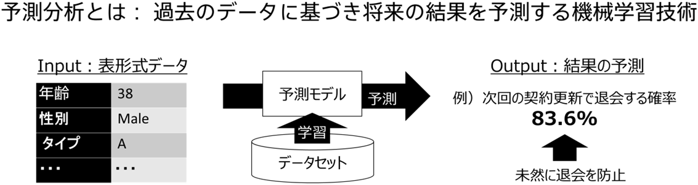

Predictive analytics is a machine learning technique that predicts future results based on historical data. For example, in the subscription service, it is possible to predict the withdrawal probability of each customer in advance and reduce the chances of withdrawal by implementing measures for customers who have a high withdrawal probability.

### Application of predictive analytics

Predictive Analytics has a wide range of applications.

|         Use case          | Prediction                               | Usage/effects                               |
| :---------------------------: | :--------------------------------- | :------------------------------------------- |
| Direct marketing/CRM | Conversion, withdrawal, and other customer behavior | Improving ROI through prediction-based customer segments  |
|           Visit sales            | Closing and other customer behavior                 | Improving efficiency by prioritizing visits to customers with a high probability of closing   |
|       Matching and recommendations        | Purchasing and other customer behavior                 | Boosting sales by presenting products with high purchase probability to customers   |
|           Demand prediction            | Predicting demand                         | Improving the accuracy of production plans by utilizing predictions           |
|    Predicting incoming calls to call centers     | Predicting the number of incoming calls                         | Improving the accuracy of operator placement based on predictions of the number of incoming calls |
|         Text classification          | Complaint/report classification           | Streamlining the classification process                               |
|             Personnel affairs              | Predicting performance and turnover                  | Improving employee performance and preventing turnover                 |
|       Risk estimation/assessment        | Default prediction                    | Improving the accuracy of and automating assessments                       |
|           Failure prevention            | Predicting failures                         | Preventing the failure of manufacturing equipment, etc.                 |
|           Fraud detection            | Detecting fraud                         | Reducing instances of fraud through high-accuracy fraud prediction           |

### Types of Predictive Analytics

Prediction One can perform three types of predictive analytics: binary classification, multinomial classification, and numerical prediction.
Prediction One refers to these three categories as "Prediction Type".

### Binary Classification

Calculates the predicted probability of two things. It's used to predict the probability of something happening. For example, you can predict whether something will be purchased or not (purchase probability), or whether it will break down or not (failure probability).

### Multiclass Classification

Calculates the predicted probability of three or more things. For example, complaint data can be used to automate classification: A. Product, B. Service, C. Other.

### Regression

Predicts numeric values. For example, it can be used to predict the number of products shipped or the closing price of real estate. There are two modes for Regression: normal mode and time series prediction mode. In time series prediction mode, the incoming dataset must meet multiple criteria, but the prediction accuracy may be increased.

{}
With Prediction One, you can actually experience failure prediction and call center incoming call prediction using sample data.
{}
