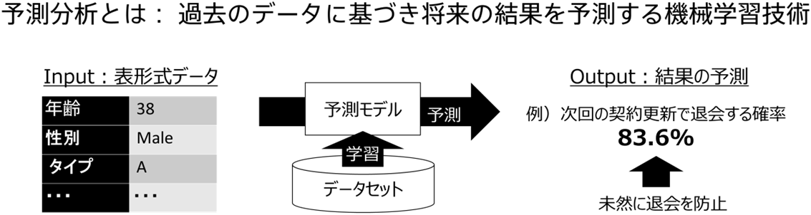

予測分析とは、過去のデータに基づいて将来の結果を予測する機械学習技術です。たとえば、定額制サービスにおいて各顧客の退会確率を事前に予測し、退会確率の高い顧客に対して施策を実施することで退会を減らす、といったことが可能になります。

### 予測分析の応用先

以下のような幅広い応用先が考えられます。

|         ユースケース          | 予測                               | 利用方法と効果                               |
| :---------------------------: | :--------------------------------- | :------------------------------------------- |
| ダイレクトマーケティング・CRM | コンバージョン、退会などの顧客行動 | 予測に基づく顧客セグメントにより ROI を改善  |
|           訪問営業            | 成約などの顧客行動                 | 成約確率の高い顧客を優先的に訪問し効率向上   |
|       マッチング、推薦        | 購入などの顧客行動                 | 購入確率の高い商品を顧客に提示し、売上増加   |
|           需要予測            | 需要の予測                         | 予測を活用し、生産計画の精度を向上           |
|    コールセンター入電予測     | 入電数予測                         | 入電数予測に基づく、オペレータ配置の精度向上 |
|         テキスト分類          | 苦情・レポートなどの分類           | 分類の工数削減                               |
|             人事              | 業績や退職の予測                   | 従業員の業績改善、退職の防止                 |
|       リスク推定・査定        | デフォルト予測                     | 査定の精度向上、自動化                       |
|           故障予防            | 故障の予測                         | 製造機器などの故障の未然防止                 |
|           不正検知            | 不正の検知                         | 不正の高精度な予測による不正の削減           |

### 予測分析の種類

Prediction One では二値分類・多値分類・数値予測の三種類の予測分析を行うことができます。
Prediction One ではこの三種類の分類を「予測タイプ」と呼んでいます。

### 二値分類

2 つの事柄に対する予測確率を算出します。ある事が起きる確率を予測するケースに利用されます。たとえば、購入するか購入しないか(購入確率)、故障するか故障しないか(故障確率)、などの予測ができます。

### 多値分類

3 つ以上の事柄に対する予測確率を算出します。たとえば、苦情データが A.製品に関するもの、B.サービスに関するもの、C.その他、などの分類の自動化に利用できます。

### 数値予測

数値を予測します。たとえば、製品の出荷数や不動産の成約価格の予測に利用できます。数値予測には通常モードと時系列予測モードがあります。時系列予測モードでは、入力となるデータセットが複数の条件を満たす必要がありますが、予測精度が高くなる可能性があります。

{}
Prediction One では、サンプルデータを使って実際に故障予測やコールセンター入電数予測を体験していただくことができます。
{}
