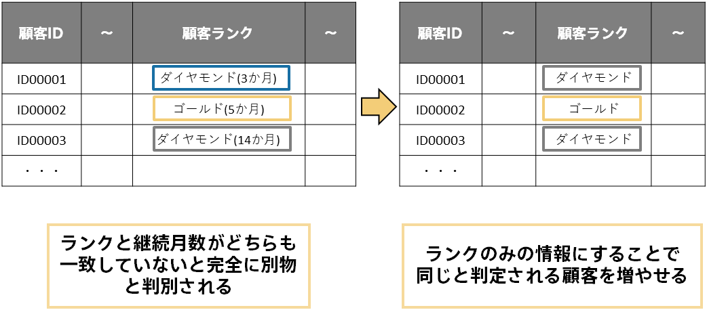

PredictionOneでは予測精度だけでなくどうしてそのような予測をしたのか？という予測の理由にあたる寄与度も確認できます（詳しくは{}）。 
寄与が高い項目がご自身の知見・経験と合致しているか確認しましょう。本来寄与が高いはずの項目の寄与度が低い場合などはデータに間違いがないか、データの入力方法に問題がないか、などを確認するとよいです。また今まで気づいていなかったけれど寄与度が高い項目も見つかるかもしれません。 
  

### タスク
- 4.2.1 寄与度が高い項目が納得のいくものであることを確認する
 
  

{}

寄与度は予測モデルの精度が高いほど確からしいものになります。逆に予測モデルの精度が低い場合の寄与度はあまり参考にならないことが多いです。寄与度を活用したい場合、まずは予測精度レベル星3～星4以上を目指しましょう。「<b>{}</b>」なども参考にしてみてください。

本来寄与が高いはずの項目の寄与度が低い場合は予測精度の改善余地がある可能性が高いです。 
「本来寄与が高いはずの項目の寄与度が低い」とは、予測したい項目との関連性が強いはずの項目が寄与度の上位に来ていない状況を指します。例えば{}で顧客ランクがプレミアムサービスの成約に強い関連性があるはずなのに寄与度の上位に来ていなかったとします。これがなぜなのか考えてみると以下のように顧客ランクを『ランク(継続月数)』で表していたことに気づきます。Prediction Oneでは文字列が少しでも違うと全く別物であると判断してしまうので、本来『ダイヤモンド(3か月)』は『ダイヤモンド(14か月)』と似ていて、『ゴールド(5か月)』とは似ていないのに、どちらも等しく似ていないと判別してしまいます（詳しくは「{}」も参考にしてみてください）。 
このような場合はデータを加工して継続月数を削除しランクの情報のみに絞ったり、データタイプを文字列型からテキスト型にすることで、顧客ランクの寄与が上昇し予測精度も改善すると考えられます。 
  

  
このように寄与度に違和感がないか確認することで予測モデルの精度改善の糸口をつかめたり、今まで気づいていなかった特徴に気づいたりできます。 
  
寄与度が高いはずの項目の寄与度が低い場合は以下も参考にしてみてください。 
  
▶ <b>{}</b>
{}
  

{}
以下はこのページで行うべきタスクの再掲です。これらのタスクが終わったら次へ進みましょう。 
  
- 4.2.1 寄与度が高い項目が納得のいくものであることを確認する
 
  
<link rel="stylesheet", href="../../../static/css/help.css">
<a href="../../apply_to_work/index.html" class="nav nav-tutorial-next">次のステップ：「5 予測をする/寄与度を活用する（業務への適用）」</a>
{}