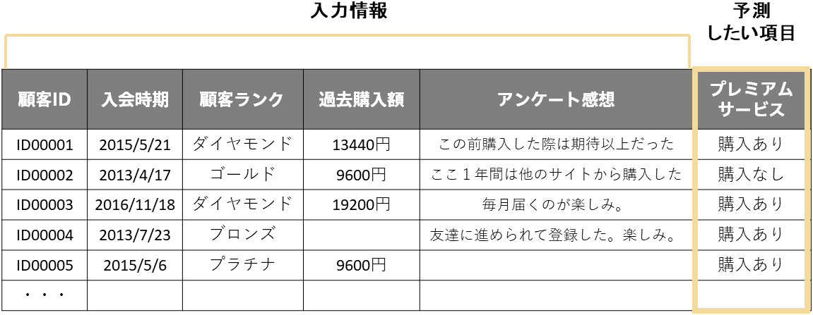
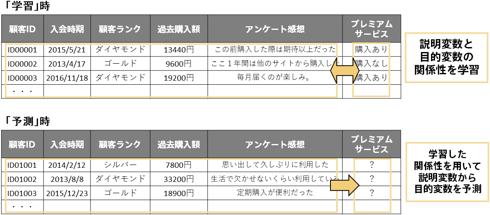

解きたい課題を設定出来たらその課題に必要なデータを用意します。良い予測モデルを作成するためにデータを収集したり、手元のデータを予測分析に利用できる形に整えたりします。 
課題にあったデータが入手できないとわかった場合は、課題設定をやり直すこともあります。 
  

### タスク
- 2.1 データを入手する
- 2.2 データの可視化などで素性を把握する
- 2.3 前処理を施し、行が各レコード、列がそれを説明する情報という形でデータを用意する
- 2.4 予測対象以外の項目は予測時も手に入るデータであることを確認する
 
  

{}

課題設定の際にデータが手元になかった場合はここで課題に沿ったデータを用意します（「<b>{}</b>」ですでにデータが手元にある場合はこのタスクは完了済みです）。予測したいと決めた項目はもちろん、それを予測したいと思ったときに参考となる情報もできる限り集めましょう。データのフォーマットや質、レコード単位などは気にせず、まずはどのようなデータが手に入りそうなのか考えるとよいです。 
データの収集では自分の手元や自分のチーム内だけでは十分な情報をそろえられないこともよくあります。必要に応じて上長や他のチームに声がけして参考となりそうな情報を収集するとよいでしょう。 
ただデータ収集に終始してしまい後続のタスクの時間が確保できないと本末転倒です。手元のデータでどの程度の予測分析ができるのかを一度試してみるというつもりで次のタスクに進むことも時には重要です。高い精度が求められた場合はこのタスクに戻ってくるとよいでしょう。 
データを入手できない場合は以下を確認してみましょう。 
  
▶ <b>{}</b>


<b>どんなデータがどのくらい必要？</b>  
どんなデータを用意すればよいか？どのくらいのデータが必要か？という質問はよく聞かれる質問です。しかし、実際のところ「やってみないとわからない」ことが多いです。というのもユースケースによって求められる精度や予測分析の利用方法が違うからです。 
どんなデータが必要か？に関してはぜひ「<b>{} ▶ {}</b>」を参考にしてみてください。 
どのくらいのデータが必要か？に関しては、参考までに以下に目安を示します。これは後のタスクの「2.3 前処理を施し、行が各レコード、列がそれを説明する情報という形でデータを用意する」の実施後にこのくらいデータが必要です、という目安になります。 
 • 行数は少なくとも100行、できれば数千行以上 
 • 列数が多い場合は列数に対して数倍～10倍ほどの行数


{}

{}

新たにデータを入手した場合はそのデータについて可視化などで素性の把握を行いましょう（こちらも「<b>{}</b>」の際すでにデータが手元にあり実施済みの場合、このタスクは完了済みです）。可視化をする意義については「<b>{}</b>」の通りで、データに潜む特徴をつかむことで予測分析に限らない有効なビジネスアクションにつながります。

{}

{}

データが用意出来たらPrediction Oneに入力できる表形式に整えます。行は各レコードで列はそのレコードを説明する情報という1つの表です。例えば顧客データの場合は、行は各顧客で列はその顧客に関する情報（入会日、顧客ランク、など）です。 
Prediction Oneには4つのデータタイプがあります。それは、日時・数値・文字列・テキストです。 

| データタイプ | 説明 |
| :--------- | :------------ | 
| 日時 | 日時データは標準的な日時フォーマットで入力された文字を日時情報として扱うことができるデータタイプです。対応している具体的なフォーマットは「{}」をご確認ください。 | 
| 数値 | 数値データは文字通り数字を扱うデータタイプです。「2」「139.48」などがこれにあたります。この際、「13440円」のように単位がついていても問題ありません。 | 
| 文字列 | 文字列データは、「プラチナ・ゴールド・シルバー」「あり・なし」などカテゴリを扱うデータタイプです | 
| テキスト | テキストはアンケート回答など自然言語で入力された文章です。Prediction Oneは内部に英語と日本語の言語解析器をもっているため自然言語に対して特別な前処理をする必要はありません。自然言語から自動的に重要な情報を抽出して学習・予測に利用します。 | 

また、列のうち1列は予測したい項目（目的変数）である必要があります。これは「<b>{}</b>」で設定した課題に沿ってどれが予測したい項目なのか決まります。 
  

  
Prediction Oneは入力されたデータに対してどのデータタイプが適切か自動で判別します。前処理では、すべての項目を数値に直さなければいけない、テキストからは事前に重要単語を抜き出しておかなければならない、といったことはありません。 
また、値が欠損していても問題なく、欠損している場合は空文字列で表現してください。 
  
どんなフォーマットでデータを用意すればよいか具体例が見たい場合は、「{}」にあるサンプルデータもぜひ参考にしてみてください。 
行が各レコード、列がそれを説明する情報という形でデータを用意できなかった場合は以下も参考にしてみてください。 
  
▶ <b>{}</b>

{}

{}

機械学習モデルの作成・予測には「学習」「評価」「予測」という3つのステップがあります（詳しくは「<b>{} ▶ {}</b>」。「学習」と「予測」の2ステップと表現することもよくあります）。 
「学習」のステップで用意したデータ（前スライドの画像のようなデータ）のうち予測したい項目以外の項目（説明変数）については「予測」のステップでも入力が必要になるデータです。 
先ほどの顧客データの場合、予測したい項目（目的変数）は「プレミアムサービス」です。これは予測したい項目ですので当然「予測」のステップでは手に入らない情報になります。一方で「入会時期」、「顧客ランク」、「過去購入額」、「アンケート結果」の項目（説明変数）は「予測」のステップでも必要な項目です。なぜなら予測モデルは「学習」のステップでこれらの項目と「プレミアムサービス」の傾向を掴み、「予測」のステップでこれらの項目の情報をもとに「プレミアムサービス」の値を出力するからです。 
  

  
つまり、用意したデータのうち予測したい項目以外の項目（説明変数）については「予測」のステップでも手に入らなければなりません。言い換えると、「予測」のステップでも手に入る項目のみを残して、それを用意したデータとすれば良いということになります。 
「予測」時に手に入らない項目が1列でも含まれたデータで予測モデルを作成しても、それは実際には使い物にならない（何も予測できない）予測モデルとなってしまいます。何が「予測」時にも手に入って、何が「予測」時には手に入らないのか注意しましょう。 
なお、時系列予測の予測モデルを作成する場合には一部または全ての説明変数が予測時に手に入らなくても大丈夫です。詳しくは「{}」をご覧ください。 
また、「<b>{}</b>」において予測分析を寄与度の分析に利用すると決めた場合はそもそも予測を行わないので手元のデータが予測時に手に入るか否かについて配慮をする必要はありません（このタスクは完了済みとして大丈夫です）。 
  
予測時に手に入るデータがない場合は以下を参考にしてみてください。 
  
▶ <b>{}</b>

{}
  

{}
以下はこのページで行うべきタスクの再掲です。これらのタスクが終わったら次へ進みましょう。 
  
- 2.1 データを入手する
- 2.2 データの可視化などで素性を把握する
- 2.3 前処理を施し、行が各レコード、列がそれを説明する情報という形でデータを用意する
- 2.4 予測対象以外の項目は予測時も手に入るデータであることを確認する
 
  
<link rel="stylesheet", href="../../../static/css/help.css">
<a href="../create_model/index.html" class="nav nav-tutorial-next">次のステップ：「3 予測モデルの作成をする」</a>
{}
