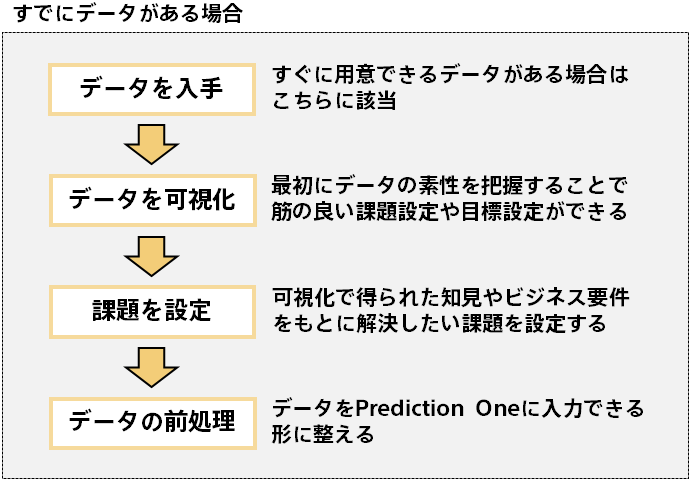
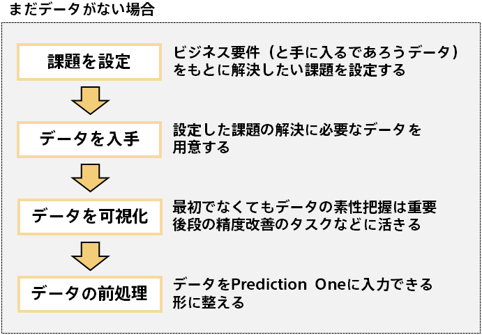

まずは抱えている課題の解決に本当に予測分析が必要なのか確認しましょう。「データを使って課題を解決したい！」、「データから価値を見い出したい！」というモチベーションに対する解決策は様々で、必ずしも予測分析が最適な解決策ではないかもしれません。もしデータを可視化するだけで十分な場合や、週次で集計されるダッシュボードがあるだけで良い場合などは予測分析ではなく、可視化やダッシュボードの作成に注力すべきです。 
予測分析は何かの値を予測しその値を使って何かしらのビジネスアクションを取りたい場合に行うデータ分析です。まずはこの点を確認して、自身の課題に対するソリューションとして予測分析が最適なのか見極めましょう（{}）。 
  

### タスク
- 1.1.1 データの可視化などで素性を把握する
- 1.1.2 可視化だけでなく未知や未来の値を予測したいのか確認する（もしくは寄与度分析をしたいのか確認する）
 
  

{}
すでにデータが手元にある場合、まずはデータの可視化を行うのがおすすめです。データの可視化をすることで今まで気づいていなかった特徴が明らかになり、何かの値を予測するまでもなく有効なビジネスアクションを着想できる場合もあります。Prediction Oneにはデータインサイト機能もありますのでこちらを用いてデータの可視化に取り組むのもおすすめです。 
  
（##### データインサイト画面のスクショ #####） 
  
まだ手元にデータがない場合も、どんなデータが手に入りそうなのかは整理しておくと良いです。そうしておくと今後のタスクをスムーズに進めることができます。 
データがまだない場合は、「<b>{}</b>」で課題を設定した後に、その課題の解決に必要なデータを「<b>{}</b>」で収集しますので、この段階で可視化による素性の把握を行うタスクが用意されています。 
  
以下はすでにデータがある場合、まだデータがない場合の大まかなタスクの流れになります。 
  

{}

{}
可視化を行いデータの特徴をつかむだけでなく、将来の値が分かれば業務に役立つような項目があるのであれば、予測分析が価値を生むはずです。「予測分析の流れ」に沿って予測モデルの作成に取り組みましょう！ 
  
まだ手元にデータがない場合も、予測された値を用いてビジネスアクションが取れる課題があるか考えてみましょう。そのような課題があれば予測分析が良いソリューションになるはずです。 
  
将来の値が欲しいわけではないが要因分析をしたい、という場合もPrediction Oneの寄与度を活用できます。このような場合も予測モデルの作成に取り組んでいきましょう。寄与度に関して詳しくは「{}」をご覧ください。 
  
また予測分析の活用例は「{}」でも紹介しています。自身の業務に予測分析が役立ちそうかこのページも参考に考えてみるとよいでしょう。
{}


<b>データの可視化で十分な例： コールセンター</b>  
オペレーターのシフトを最適化するために今までの入電数の分析をしたい。まずは入電数の実績を確認するために、データの可視化を行ってみた。すると毎週木曜日は入電数が多いことが分かった。これであれば木曜日だげ増員すればよいので予測までは行わなくてもよさそうだ。



<b>データの可視化だけでなく予測が必要な例：機器の故障予測</b>  
人手やコストの観点からすべての機器を頻繁に点検できないので、より故障リスクの高いものから点検したい。過去のデータを可視化すると稼働からの経過時間が長いほど故障しやすいことはわかったが、機器のタイプや稼働環境の影響も大きく一概に稼働からの経過時間で点検する機器を決定するのは筋が悪そうだ。予測分析を活用することで様々な項目の影響を加味した故障予測を行えれば点検が効率化するはずだ。


{}
以下はこのページで行うべきタスクの再掲です。これらのタスクが終わったら次へ進みましょう。 
  
- 1.1.1 データの可視化などで素性を把握する
- 1.1.2 可視化だけでなく未知や未来の値を予測したいのか確認する（もしくは寄与度分析をしたいのか確認する）
 
  
<link rel="stylesheet", href="../../../static/css/help.css">
<a href="../setting_detailed_theme/index.html" class="nav nav-tutorial-next">次のステップ：「1.2 予測分析で解きたい課題を設定する」</a>
{}
