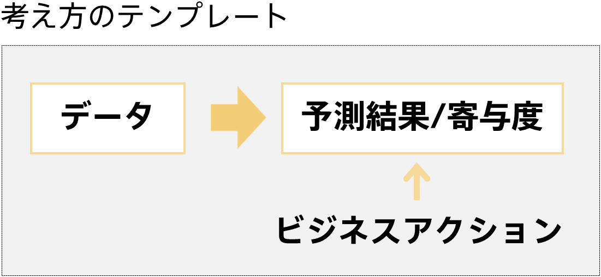
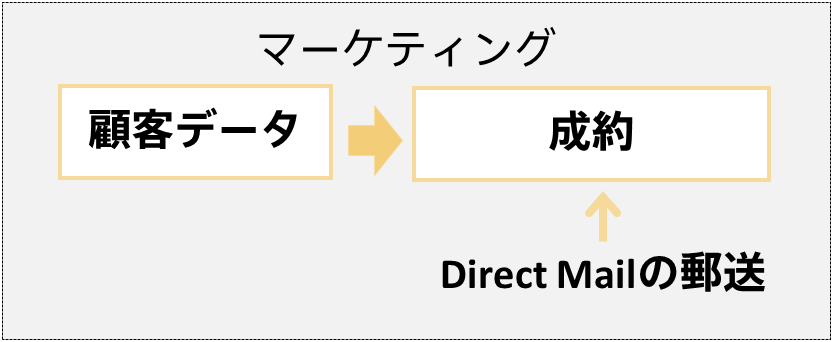
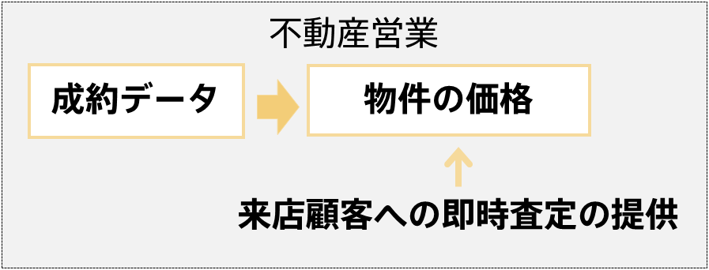

予測分析では一列を予測したい列（目的変数）とし、それ以外の列をその予測したい列を予測するに際して参考になる情報（説明変数）とします。このとき、予測対象には予測ができる事で嬉しいものを選ぶ必要があります。予測できたところで実際にビジネスアクションが起こせないのであれば、それは予測をしてもあまり意味がない列かもしれません（予測を活用したいのではなく寄与度を活用したい場合はこの限りではありません）。 
データ、予測結果/寄与度、ビジネスアクションがご自身の場合では何なのかということを考え、課題を設定していきます。 
  

### タスク
- 1.2.1 予測結果/寄与度から起こすビジネスアクションを考える
- 1.2.2 データの中でどれを予測対象にするか決める
- 1.2.3 予測モデルの精度目標を明文化する
 
  

{}
データ、予測結果/寄与度、ビジネスアクションがご自身の場合では何なのかということを考えるうえでのテンプレートとして以下の図を参考にしてみてください。 
どんなデータを使って、どんな予測結果/寄与度を出したいのか、その予測結果/寄与度を利用して、どんなビジネスアクションを実行したいのか、これに答えられないと予測分析を活用することは難しいです。 
  

  

例えば、マーケティングの例で考えてみます。この場合、データは入会日、過去購入額、会員種別、…などの顧客に関するデータです。予測結果は成約するかどうかです。そして、予測結果に基づき、成約の可能性がある顧客だけにダイレクトメールを郵送する、というのがビジネスアクションになります。 
  

  

他にも不動産営業の例も見てみましょう。この場合、データは建物面積、築年数、所在地、…などの物件に関するデータです。予測結果は物件の価格です。そして、予測結果に基づき、来店顧客に対して物件の即時査定の提供をする、というのがビジネスアクションになります。 
  

  

必ずしも予測結果からビジネスアクションを起こす必要はありません。Prediction Oneでは予測モデルを作成した際に寄与度が算出されます。この寄与度を用いたアクションを目標とすることも予測分析ではよくあります。寄与度に関して、詳しくは「{}」をご覧ください。 
寄与度からビジネスアクションを起こす例として、生産ラインの例を見てみましょう。この場合、データは機器Aの温度、機器Bの回転数、機器C通過後の湿度、…などの生産ライン中の各種センサーデータです。寄与度は製品不良の原因候補です。寄与度が高い項目は製品の正常/不良を予測するにあたって重要だった項目、つまり不良の原因になっている可能性がある項目ですので、寄与度が高い項目に関して点検を行う、というのがビジネスアクションになります。 
  

  
データ、予測結果/寄与度、ビジネスアクションがご自身の場合どういったものを設定できるのかを考えてみましょう。 
{}

{}
データ、予測結果/寄与度、ビジネスアクションが決められたら、改めて何を予測対象に予測モデルを作成するのか整理しましょう。その予測対象について、予測タイプが「二値分類」、「多値分類」、「数値予測」、「時系列予測」で表現できるものでないとPrediction Oneで予測モデルは作成できません（予測分析の対象外）。ご自身の考える予測対象で予測モデルを作成したとき、予測タイプがこれのうちどれに当たるのか考えてみましょう。問題なくこれらに該当する場合はそれを予測対象とします。


<b>予測分析の対象外となる例</b> 
データとして過去のお問い合わせとオペレータ応答のペア、予測結果として適切な応答、ビジネスアクションとしてFAQの作成を設定したとしましょう。この場合、予測対象である「オペレータ応答」の予測は二値分類、多値分類、数値予測、時系列予測のどの予測タイプにも該当しないため、予測分析の枠組みで予測モデルの作成はできません。 
ビジネスアクションが取れ、かつ予測分析の枠組みに落とし込める課題を設定する必要があります。例えば、お問い合わせを複数の担当者に分類することで業務の効率化が図れるような場合は、これは多値分類に該当するので予測分析の枠組みに落とし込めたことになります。 
  
 {} ▶ {} 


予測タイプが決まったらぜひ一度自分の予測タイプの予測モデルをチュートリアルで作成してみてください（近い業界でなくてもOK）。ご自身のケースで予測モデルを作成していくイメージがつかめるはずです。 

予測タイプごとのチュートリアル

| 予測タイプ | チュートリアル |
| :--------- | :------------ | 
| 二値分類 | {}   {}   {}   {}   {}   {}   {}   {}   | 
| 多値分類 | {}   {}   | 
| 数値予測 | {}   {}   {}   {}   | 
| 時系列予測 | {}   {}   {}   {}   | 

{}

{}
予測モデルの精度目標をあらかじめ決めておくことも重要です。これはビジネス上の目標と似ていますがやや異なります。ここで決める目標とは、ビジネス上の目標を達成するために予測モデルにはどの程度の予測精度が求められるのか、を考えその精度を目標に据える、というものです。 
  
マーケティングの例で考えてみます。ビジネス上の目標として成約数を昨年度より100件増やすというものがあったとします。年間を通して様々な施策を行う中でダイレクトメール経由の成約数は昨年度より40件増えるとビジネスの目標達成に近づきそうです。毎年ダイレクトメールは抽出した顧客500人に送っており、去年はダイレクトメール経由で310人が成約しました。今年度40件成約を増やすためにはダイレクトメールを送る500人の顧客のうち350人が成約する必要があります。すると、求められる予測モデルの精度は「成約と予測した顧客のうち70%が成約する」となり、これが予測モデルの精度目標となります。 
さらに詳しく考えると「成約と予測した顧客<b>全体</b>のうち70%が成約する」必要がないことが分かります。なぜならばダイレクトメールは500人の顧客にしか送らないからです。そうすると目標は「成約と予測した顧客<b>から抽出した500人</b>のうち70%が成約する」と書き換えられます。しかし、成約と予測した顧客からランダムに500人抽出するのはもったいないです。二値分類では予測モデルはどちらになる確率がどの程度か？という値を出力するため、成約となる確率が高い順に送ったほうがよさそうです。つまり目標は「<b>成約の予測確率が高い上位500人の顧客</b>のうち70%が成約する」となり、評価用データに対する予測で「<b>成約の予測確率が高い上位500人の顧客</b>のうち70%が成約」というのが予測モデルの精度目標になります。 
（評価用データに関して詳しくは、「<b>{} ▶ {}</b>」をご覧ください。）


二値分類では予測モデルはどちらになる確率がどの程度か？という値を出力します。詳しくは二値分類のチュートリアル（例えば「{}」）をご確認ください。


<!-- 既存の属人的な予測プロセスと同程度以上の精度の予測モデルを作成し業務自動化の目途が立てば成功なのか、今まで予測が業務には導入されていなかったがXX%程度当たれば実用に耐えうる精度といえるのでそれを目指すのか、など成功条件は各ユースケースごとに様々です。  -->
ご自身のケースでビジネス上の目標を達成するためには、予測モデルにどの程度の精度が求められるのか考えてみましょう。Prediction Oneでは自動で評価値を計算して表示されますが上記のマーケティングの例のように個々のケースによっては表示されている精度をそのまま目標値とするのが適していない場合もあります。Prediction Oneに表示される精度の種類にとらわれず、ご自身のケースでどの程度の精度が求められるのか考える必要があります。 
予測結果を個人で利用するのではなくチームで利用するということも予測分析ではよくあります。この場合、ビジネス上の目標や予測モデルの精度目標について事前にコンセンサスを取っておくことも重要です。目標の設定に際しチームで議論をすることが必要な場合もあります。
{}


<b>その他の課題を設定する際の注意点</b> 
予測分析は表形式データを対象とした機械学習技術です。ご自身が用意できるデータが表形式で表すことができるものなのか確認しましょう。 
  
 {} ▶ {} 
 {} ▶ {} 

  

{}
以下はこのページで行うべきタスクの再掲です。これらのタスクが終わったら次へ進みましょう。 
  
- 1.2.1 予測結果/寄与度から起こすビジネスアクションを考える
- 1.2.2 データの中でどれを予測対象にするか決める
- 1.2.3 予測モデルの精度目標を明文化する
 
  
<link rel="stylesheet", href="../../../static/css/help.css">
<a href="../measurable_effect/index.html" class="nav nav-tutorial-next">次のステップ：「1.3 予測分析で得られた効果を測定できるようにする」</a>
{}
