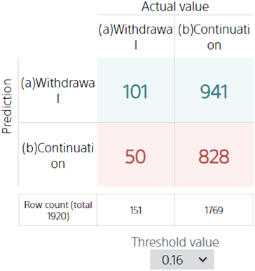
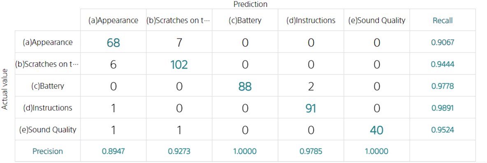

**Confusion Matrix** is a way of verifying the performance of models in binary and multiclass classification.
You can get a complete picture of how to correctly and incorrectly classify.

### Confusion Matrix in binary classification

Take the {} tutorial as an example. In this tutorial, we try to predict whether a user will be designated as a "(a) Withdrawal" or "(b) Continuation" by choosing whether to leave or not.

Using a confusion matrix, a prediction model can predict whether a person will withdraw from the evaluation data, and check when the prediction is likely to be correct or not.

Looking at the first column, you can see that out of the data in which "(a) Withdrawal" included in the evaluation data is correct,
4 pieces of data were predicted to be "(a) Withdrawal" and 7 pieces of data to be "(b) Continuation".

**Threshold** is a criterion for determining the probability of "(a) Withdrawal" at which the model will predict "(a) Withdrawal". In this case, an "(a) Withdrawal" probability of over 16% will result in an "(a) Withdrawal" prediction. The resulting confusion matrix is shown above.

### Confusion Matrix in multiclass classification

The idea is the same even if there are more than two types of variables to predict.

Take the {} tutorial as an example. Now,
suppose you have classified the following six categories: "(a) Nothing in particular", "(b) Scratches on the product", "(c) Battery", "(d) Instructions", "(e) Disappointment", and "(f) More than one complaint".

In this case, regarding data in which the "(b) Scratches on the product" included in the evaluation data is correct,
2 pieces of data were predicted to be "(a) Nothing in particular" and 24 pieces of data to be "(b) Scratches on the product".

If we look at the second column, out of the 24 pieces of data that we predicted to be "(b) Scratches on the product," all 24 "(b) Scratches on the product" were correct, so the Precision is 24/24 = 1.0000.

Looking at line 2, out of 26 pieces of data for which "(b) Scratches on the product" is correct, we were able to predict "(b) Scratches on the product" for 24 pieces, so Recall is 24/26 = 0.9231.

{}

- {}
- {}

{}
