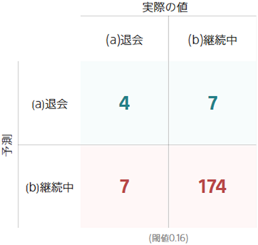
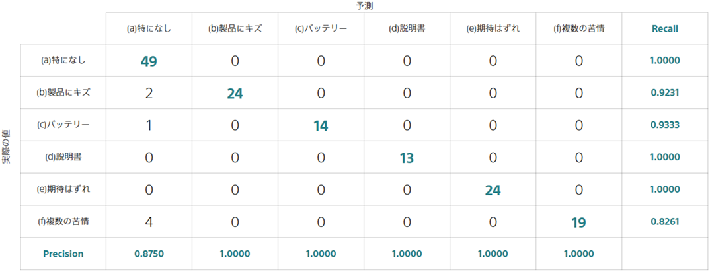

**混同行列**は、二値分類・多値分類におけるモデルの性能を確認する方法のひとつです。
分類の正解・不正解のしかたの全体像を把握できます。

### 二値分類における混同行列

{}のチュートリアルを例に説明します。このチュートリアルでは予測したい項目として退会有無を選択しており、ユーザーが「(a)退会」するか「(b)継続中」となるかを当てようとしています。

混同行列を使うと、評価用データに対して予測モデルが退会有無を予測をして、その予測がどの様な場合によく当たるか・外れてしまうかを確認できます。

1 列目に注目すると、評価用データに含まれる「(a)退会」が正解のデータについて、
4 個のデータを「(a)退会」、7 個のデータを「(b)継続中」と予測しました。

**閾値**は、どれくらいの確率で「(a)退会」すると判断したら「(a)退会」と予測するかの基準を表しています。この場合、「(a)退会」する確率が 16%を超えた場合「(a)退会」すると予測しています。その結果得られた混同行列が上の図になります。

### 多値分類における混同行列

予測したい項目の種類が 2 種類より多くなっても見方は同じです。

{}のチュートリアルを例に説明します。今、
「(a)特になし」、「(b)製品にキズ」「(c)バッテリー」「(d)説明書」「(e)期待はずれ」「(f)複数の苦情」の 6 種類の分類をしたとします。

この場合、評価用データに含まれる「(b)製品にキズ」が正解のデータについて、
2 個のデータを「(a)特になし」、24 個のデータを「(b)製品にキズ」と予測しました。

2 列目に注目すると、「(b)製品にキズ」と予測したデータ 24 個のうち、24 個すべて「(b)製品にキズ」が正解であるデータだったので Precision は 24/24 = 1.0000 になります。

2 行目に注目すると、「(b)製品にキズ」が正解であるデータ 26 個のうち、24 個について「(b)製品にキズ」を当てることができたので Recall は 24/26 = 0.9231 になります。

{}

- {}
- {}

{}
