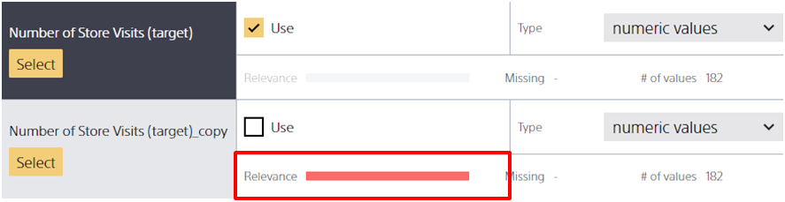

Relevance score indicates the relevance of a given variable to the variable to predict.

This is the formula for calculating the score.

"MI" corresponds to the mutual information obtained from the two variables. The "coefficient calculated based on the uniqueness rate of the correlation between two variables" is a coefficient calculated based on variable uniqueness rate. Variables with high uniqueness rates, such as name and ID, have coefficients near 0 and low relevance scores.
For variables like name and ID that do not have a high uniqueness rate, however, the "coefficient calculated based on the uniqueness rate of the correlation between two variables" is close to 1, and the relevance score depends on the mutual information between the two.

However, **relevance scores are not calculated for text-type variables, for date-type variables, or when time series prediction mode is selected**.
Relevance score can also vary depending on the number of pieces of data read, missing data, and other factors.

## Low relevance scores

Variables that have high uniqueness rates (ID, name, etc.) and are not particularly relevant to the variable to be predicted have low relevance scores.
While it is possible to perform predictions using ID and name variables, prediction models that use these types of variables are very rarely useful in actual operations.

## High relevance scores

Copies of the variable to be predicted and variables with high correlation levels produce high relevance scores.
When the relevance score is close to the maximum level, an {} may be occurring.
In these types of cases, check whether the problem setting is correct in using that variable for prediction.