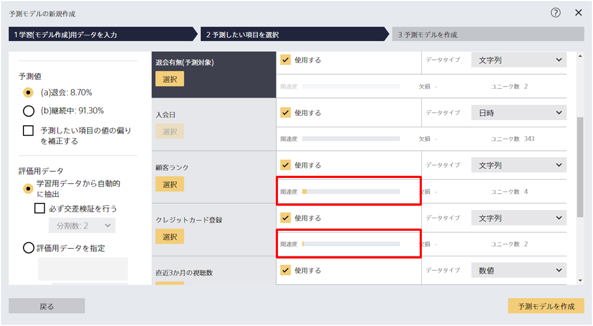
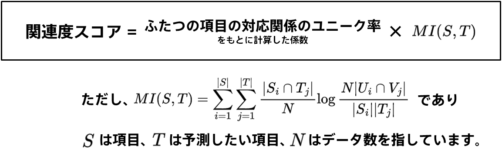
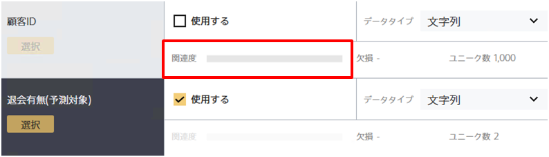
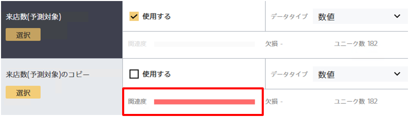

関連度スコアとは、その項目と予測したい項目との間の関連度を示したものです。

具体的には以下のような計算によってスコアを求めています。

『MI』はふたつの項目から求められた相互情報量を指しています。『ふたつの項目の対応関係のユニーク率をもとに計算した係数』は項目のユニーク率をもとに算出した係数であり、氏名やIDといったユニーク率が高い項目はこの係数が0に近い値となり関連度スコアは低くなります。
氏名やIDといったユニーク率が高い項目ではない場合は『ふたつの項目の対応関係のユニーク率をもとに計算した係数』は1に近い値をとり、相互情報量をもとに関連度スコアが決定します。

ただし、**テキスト型項目と日付型項目に対しては関連度スコアは計算されず、また時系列予測モード選択時には計算されません**。
また、読み取ったデータの数や欠損によって関連度スコアが変化することがあります。

## 関連度スコアが非常に低い場合

IDや氏名のような、ユニーク率が高く予測したい項目との間に関係性が見られない項目は関連度スコアが低くなります。
IDや氏名を用いて予測を実行することもできますが、ほとんど場合はこれらの項目を用いた予測モデルは実運用では活用できないことが多いです。

## 関連度スコアが非常に高い場合

予測したい項目をコピーした項目や、相関が非常に高い項目は関連度スコアが高くなります。
とくに、関連度スコアが最大に近い状態は {}が発生している可能性があります。
その項目を使って予測をすることが正しい問題設定であるか、ぜひ一度ご確認ください。