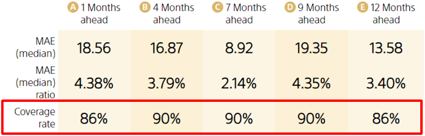

Coverage rate is the probability that the actual value will be between the upturn and downturn in an upturn/downturn prediction. Because Prediction One trains models to have a coverage rate near 90%, the closer the number is to 90%, the better the model is training.

This is the formula for calculating the score.

Since there is no way to observe actual upturn/downturn values, you cannot calculate the coefficient of determination, median absolute error, or other metrics used in time series prediction. In addition, a coverage rate of 90% does not necessarily guarantee upturn/downturn accuracy. Use coverage rate as a basic gauge for determining whether upturn/downturn predictions seem reasonable.

{}

- {}

{}
