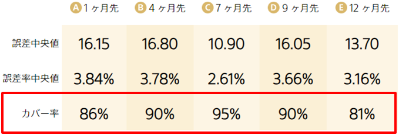
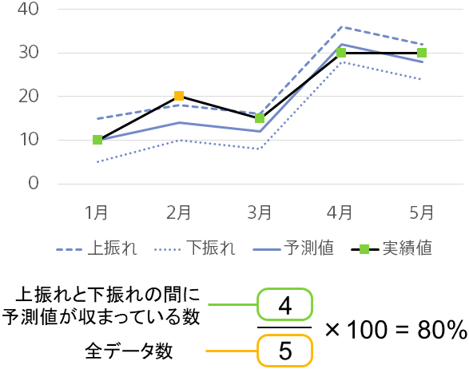

---
title: "カバー率"
date: 2023-06-08T18:00:00+06:00
lastmod: 2023-06-08T18:00:00+06:00
weight: 2200
draft: false
# metaタグのパラメータ
meta:
  description: "カバー率は上振れ下振れ予測を行ったときに、上振れと下振れとの間に正解値が収まる確率です。カバー率の目標値は90%に設定されています。"
# クラウド・デスクトップ限定ページの場合は片方のみtrueにする
visible:
  is_cloud_only: false
  is_desktop_only: false
# 検索でヒットする文字列の指定
keywords: ["上振れ下振れ予測", "カバー率"]
---

カバー率は、上振れ下振れ予測を行ったときに上振れと下振れとの間に実績値が収まる確率です。PredictionOneではカバー率は90%に近くなるようモデルを学習しており、値が90%に近いほどモデルが良く学習できていると言えます。

具体的には以下のような計算によってスコアを求めています。

上振れと下振れは実績値を観測することができないため、決定係数や誤差中央値等といった時系列予測に用いられる指標を計算することができません。また、カバー率が90%になったから上振れ下振れの正確さが保証できるわけでもありません。上振れ下振れ予測が妥当かどうかを判断するための目安の一つとして、カバー率をご参照ください。

{}

- {}

{}
