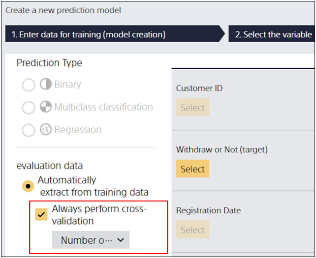

**Cross-validation** is a method of verifying the performance of a prediction model more accurately by dividing a given piece of data for learning and verification, and repeating the work of learning and evaluating the prediction model while changing the division point.

Prediction One performs cross-validation internally if the option of cross-validation is specified.
It also automatically performs cross-validation when the amount of data is small.

Cross-validation increases the number of times the predictive model is learned and evaluated, which can increase the time it takes to obtain evaluation results.

### Perform cross-validation with Prediction One

Please check Advanced Settings on the prediction model creation screen, and
check [Cross-validation].

