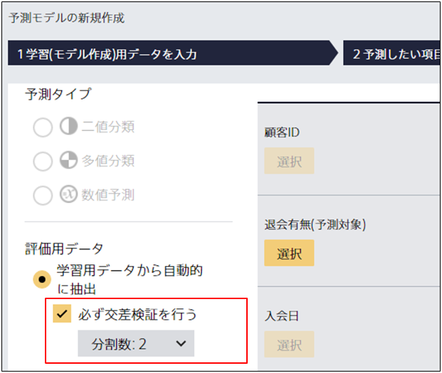

**交差検証**とは、与えられたデータを学習用と検証用に分割し、予測モデルの学習と評価を行う作業を、分割点を変えながら繰り返すことで、予測モデルの性能をより正確に検証する手法を指します。

Prediction One では、交差検証のオプションが指定された場合、内部で交差検証を実行します。
また、データ数が少ない場合には自動的に交差検証を行います。

交差検証をすると予測モデルの学習と評価の回数が増えるため、評価結果を得るまでの時間が長くなる場合があります。

### Prediction One で交差検証を行う

予測モデルの新規作成画面にて詳細設定にチェックを入れ、
「必ず交差検証を行う」にチェックを入れてください。

