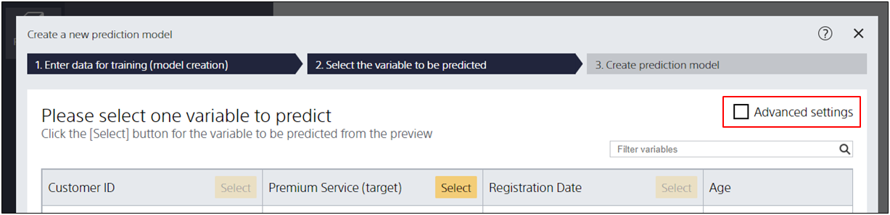

**Advanced Settings** are settings for switching the way the screen for selecting items to be predicted is displayed. Checking the "Advanced Settings" checkbox will take you to the Advanced Settings screen.

Advanced settings allow you to change the data type and specify evaluation data.
Typically, these specifications are set automatically by Prediction One.
