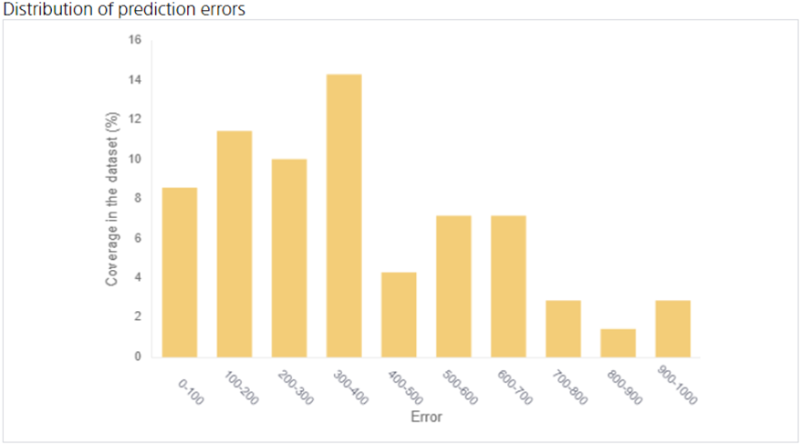

**Distribution of Prediction Errors** is a graphical representation of how much percent of the data contained in the evaluation data is wrong (= Error) when the prediction model is evaluated using the evaluation data.

Distribution of prediction errors shows the overall picture of prediction errors.
The bar chart shows the percentage of the total prediction error between 0 and 5, the percentage of the total prediction error between 5 and 10, and so on.
You can see what kind of error the prediction is likely to have.

In the figure above, approximately 11.4% of the data in the evaluation data was predicted with an error within 0 to 100.
Also, no data with an error of 700 to 800 existed.

{}

- {}

{}
