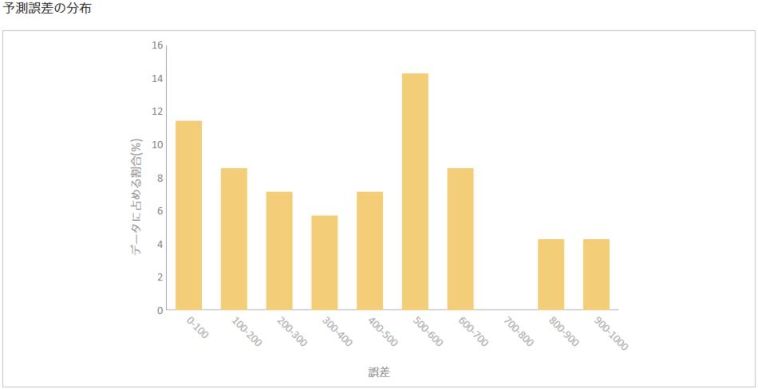

**予測誤差の分布**とは、予測モデルを評価用データを用いて評価したとき、評価用データに含まれるデータのうち何%がどれくらい予測を誤ったか（＝誤差）をグラフで表現したものです。

予測誤差の分布から、予測誤差全体の様子がわかります。
予測誤差が 0 以上 5 未満に収まるのは全体の何％か、5 以上 10 未満に収まるのは全体の何％か、…といった予測誤差の分布が棒グラフとして表示されます。
予測がどういった誤差になりやすいのかを見ることができます。

上の図の場合、評価用データに含まれるデータのおよそ 11.4%が 0~100 に収まる範囲の誤差で予測を行うことができたことを表しています。
また、誤差が 700~800 であるデータは一件も存在しなかったことを示しています。

{}

- {}

{}
