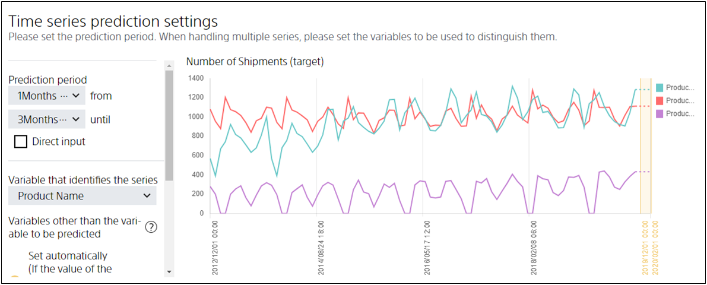

**Prediction Interval** refers to the period from when to when you want to predict in the time series prediction model.

Suppose you want to predict the number of shipments for each product between January and March 2019.
Prepare data for the number of shipments of product A, product B, and product C for each month until December 2018 as the prediction model creation (training) data, and input it into Prediction One.

The <u>January to March 2019 period for which you want to predict the number of shipments is 1 to 3 months ahead of December 2018, the last month included in the data for prediction model creation (training)</u>. In such cases, specify "from a month to three months from now" as the prediction interval.

{}

- {}
  {}
