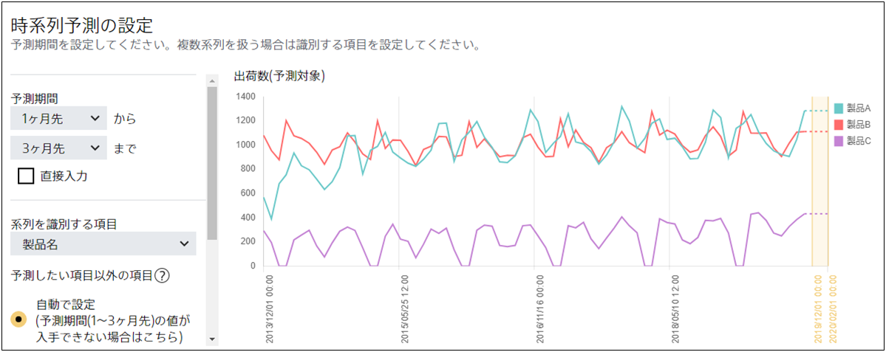

**予測期間**とは、時系列予測モデルにおいていつからいつまでの予測をしたいかの期間を指しています。

2019 年 1 月～ 3 月の各製品の出荷数を予測したいとします。
予測モデル作成(学習)用データとして 2018 年 12 月までの毎月の製品 A・製品 B・製品 C の出荷数のデータを準備して、Prediction One に入力します。

出荷数を予測したい<u>2019 年 1 月～ 3 月は予測モデル作成(学習)用データに含まれる最後の月である 2018 年 12 月の 1~3 カ月先の期間</u>です。このような場合、予測期間として「1 カ月先から 3 カ月先まで」を指定してください。

{}

- {}
  {}
