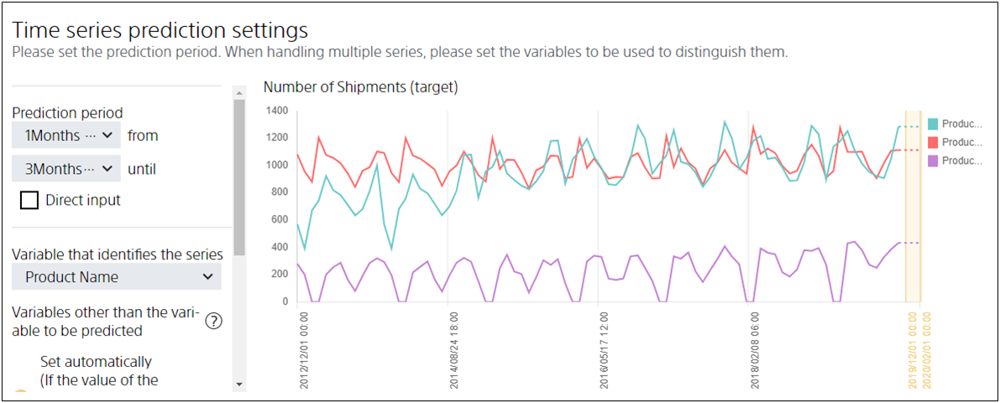

Prediction One can perform multiple time series predictions at the same time, but to create multiple time series prediction models at the same time, you need to organize your prediction model creation (training) data based on the values contained in specific variables.
The variables used in this case are called **series**.

For a specific example, let us use the data used in {} to explain what a series is.
The data used in {} records the number of shipments per month for "Product A", "Product B", and "Product C".
When this data is specified as prediction model creation (training) data in Prediction One, the following graph is displayed, and it becomes possible to make the time series prediction of "Product A", "Product B", and "Product C".

In this case, Prediction One internally stores the original data in three parts:

- a row where the "Product name" variable is "Product A"
- a row where the "Product name" variable is "Product B"
- a row where the "Product name" variable is "Product C"

A time series prediction model is then created for each of "Product A", "Product B", and "Product C".
In this example, "Product name" is the variable that identifies the series, and "Product A", "Product B", and "Product C" are the series.
