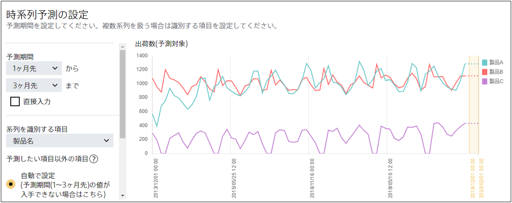

Prediction One では同時に複数の時系列予測を行うことができますが、同時に複数の時系列予測モデルを作成するためには予測モデル作成(学習)用データを特定の項目に含まれる値に基づいて整理する必要があります。
この時に使用される項目の値を**系列**と呼びます。

具体例として {}で使用するデータで系列とは何かを説明します。
{}で使用するデータには「製品 A」「製品 B」「製品 C」の月ごとの出荷数が記録されています。
このデータを Prediction One の予測モデル作成(学習)用データとして指定すると以下のようなグラフが表示され、「製品 A」「製品 B」「製品 C」それぞれについての時系列予測をすることが可能になります。

このとき、Prediction One は内部で元データを

- 「製品名」項目が「製品 A」である行
- 「製品名」項目が「製品 B」である行
- 「製品名」項目が「製品 C」である行

の 3 つに分割し、「製品 A」「製品 B」「製品 C」それぞれの時系列予測モデルを作成しています。
この例では、「製品名」が系列を識別する項目、「製品 A」「製品 B」「製品 C」が系列になります。
