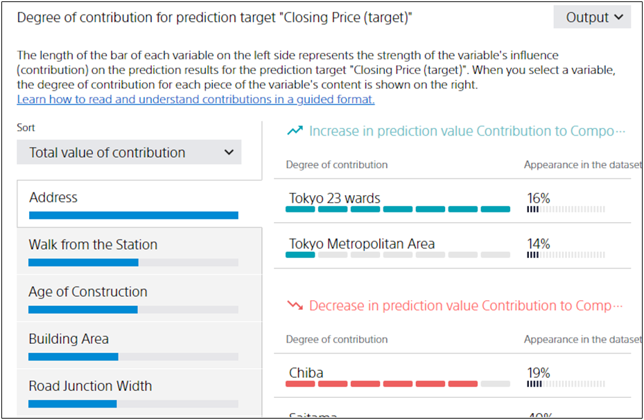

**Contribution** is a numerical expression of how much each item and value of the data affects the prediction result.
For example, suppose you create a prediction model that predicts the closing price of real estate and you get the following results:

In this case, it can be read that real estate properties whose "Address" is "Tokyo 23 wards" are likely to have an increase in "contract price".
For further details on reading the contribution, see "{}".

{}

- {}
  {}
