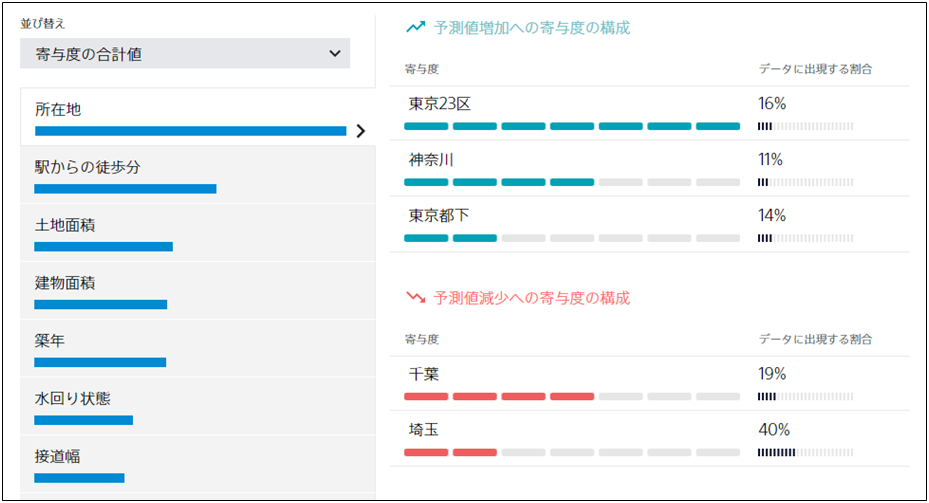

**寄与度**とは、データの各項目・各値がどの程度予測結果に影響を与えているかを数値で表現したものです。
たとえば、不動産の成約価格を予測する予測モデルを作成した結果、以下の図のような結果が得られたとします。

この場合、「所在地」が「東京 23 区」である不動産は「成約価格」が増加する傾向にありそうだ、と読み取ることができます。
より詳細な寄与度の見方については、{}を参照してください。

{}

- {}
  {}
