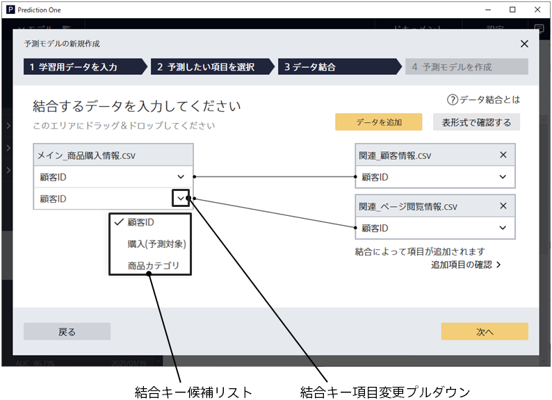

{}
Data Join is available for the {} only.
{}

In a data join, **join key variable** are variables with common values that represent the correspondence between the training data and the related data.
When you {} the related data, the join process is performed by looking for a match in the values of the join key variable.

### Handling a Join Key Variable in Prediction One

When related data is added in the data join screen, Prediction One automatically judges the join key variable of the training data and related data, and displays the join relation.
In automatic judgment, a judgment is made based on the matching degree of the variable name, data type, and value, and the variable with the highest matching degree is judged as the join key variable.

If a different join key is selected than expected, you can change the join key variable from the Change Join Key Variable pull-down.

Refer to {} for a description of data joins.

{}

- {}
- {}
  {}
