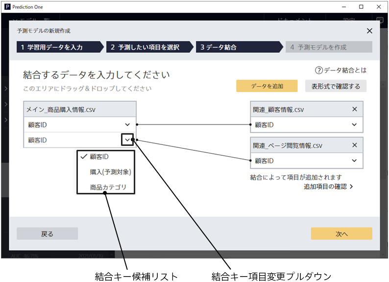

{}
データ結合は{}のみ利用可能です。
{}

データ結合における**結合キー項目**とは、予測モデル作成(学習)用データと関連データの間の対応を表現するための、共通の値を持つ項目を指します。
関連データを{}する時、結合キー項目の値の一致を見ることで結合処理が実行されます。

### Prediction One での結合キー項目の扱い

Prediction One ではデータ結合画面において、関連データが追加されると、予測モデル作成(学習)用データと関連データの結合キー項目の自動判定をおこない、結合関係を表示します。
自動判定では、項目の名前・データタイプ・値の一致度を元に判定が行われ、もっとも一致度の高い項目が結合キー項目と判定されます。

想定と異なる結合キーが選択されている場合は、結合キー項目変更プルダウンから結合キー項目を変更することが可能です。

データ結合についての説明は、{}も参照してください。

{}

- {}
- {}
  {}
